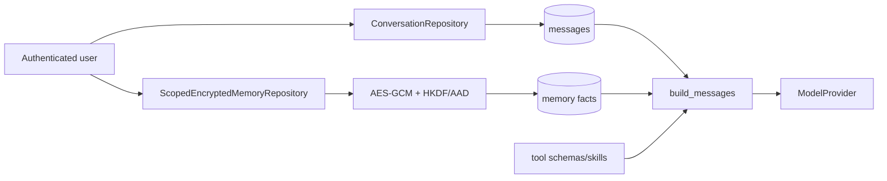
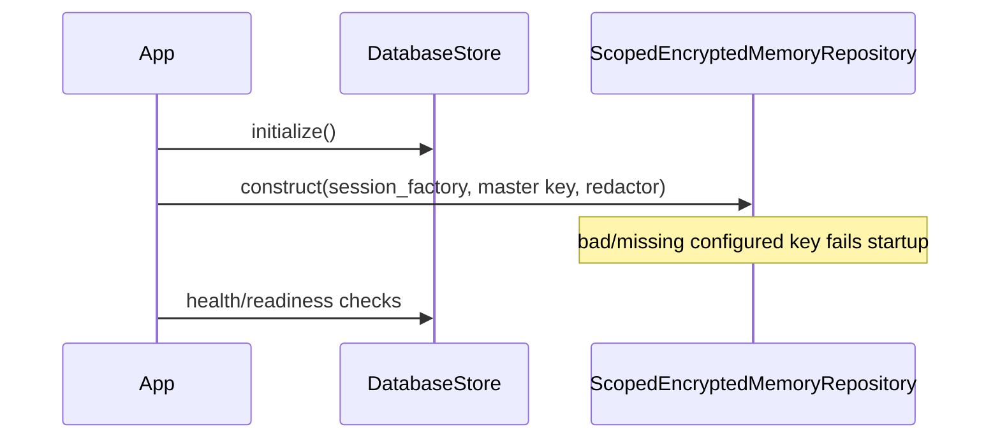
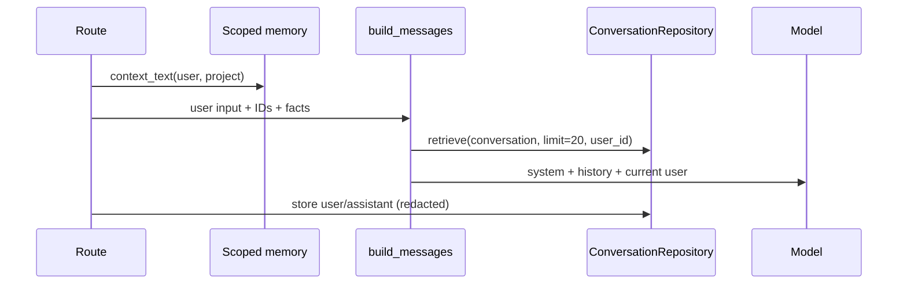
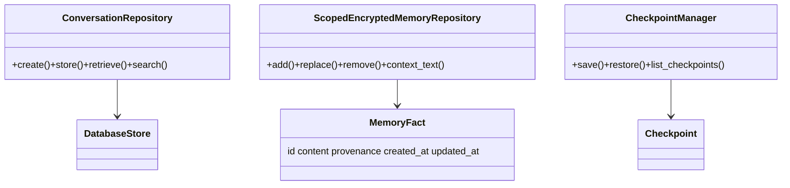

# Module 06 — Context, conversations, and encrypted memory

**Status:** implemented core, partial context inspection/compaction

## Beginner explanation

A model does not remember a chat by itself. Archon constructs each request from a system instruction, tool descriptions, selected persistent facts, recent conversation messages, and the new user turn. **Context** is the bounded input sent now; **conversation history** is durable message data; **memory** is selected durable facts. Treating these as separate stores prevents accidental cross-user recall and makes deletion and provenance comprehensible.

## Prerequisites

Know messages/roles, tokens, authenticated owner and project scopes, authenticated encryption, and database transactions. Review [context windows](../../concepts/context-windows.md), [conversation lifecycle](../../concepts/conversation-lifecycle.md), [encrypted memory](../../concepts/encrypted-memory.md), and [checkpoints](../../concepts/checkpoints.md).

## Learning outcomes

You can trace context construction; distinguish history, fact memory, and checkpoint snapshots; explain owner/project isolation and AES-GCM AAD; test restart/tamper behavior; and state why compaction is only partially evidenced.

## Problem and mental model

Think of a packing list, not a brain: the database owns history and facts; `build_messages` chooses what enters this model call. Facts are an encrypted, quota-bounded notebook keyed by `(user_id, project_id)`. A checkpoint freezes state for restoration/forking; it is not automatically replayed model execution.

## Architecture



## Startup sequence



## Per-request sequence



## State/class model



## Source symbols to inspect

- `backend/app/runtime/context.py`: `build_messages` (20-message selection and prompt assembly).
- `backend/app/services/conversations.py`: `ConversationRepository.create`, `store`, `retrieve`, `search`.
- `backend/app/memory/scoped.py`: `ScopedEncryptedMemoryRepository`, `_key`, `_aad`, `_encrypt`, `_decrypt`, `_lock_scope`, `context_text`.
- `backend/app/memory/encrypted_memory.py`: `EncryptedMemoryStore` is an in-memory teaching implementation, not the durable scoped repository.
- `backend/app/memory/checkpoints.py`: `Checkpoint`, `CheckpointManager` are in-memory snapshots.
- `backend/app/services/auto_compact.py`: `auto_compact_context`; code exists, but do not infer comprehensive live-path proof.

## Tests and evidence

- `backend/tests/unit/test_scoped_encrypted_memory.py`: scope isolation, ciphertext-at-rest, tamper/wrong-key failure, restart, concurrent quota serialization.
- `backend/tests/integration/test_memory_api_scoping.py`: authenticated API boundaries.
- `backend/tests/security/test_conversation_ownership.py` and `backend/tests/unit/test_conversations.py`: ownership and persistence.
- `backend/tests/unit/test_memory.py`: isolated in-memory Fernet store.
- `docs/IMPLEMENTATION-EVIDENCE.md`: current capability claim; older audits are historical.

## Executable exercise

From repository root:

```bash
cd backend
uv run pytest -q tests/unit/test_scoped_encrypted_memory.py tests/unit/test_conversations.py
uv run pytest -q tests/integration/test_memory_api_scoping.py
```

Then trace one fact: `add` redacts, locks scope, enforces `MAX_MEMORY_CHARS`, encrypts content plus provenance, writes ciphertext, and `context_text` decrypts only in the same owner/project scope.

## Security and failure modes

- AAD binds ciphertext to owner, project, fact ID, and key version; swapping rows or tampering fails closed with `MemoryEncryptionError`.
- Redaction occurs before memory/message persistence, but encryption does not replace authorization, minimization, retention, or backups policy.
- Concurrent mutations lock a scope aggregate so quota checks are serialized.
- Wrong/missing key makes durable facts unreadable; there is no online key rotation.
- Context can leak facts if callers pass the wrong scope; route/tool binding and tests are part of the boundary.

## Observability and evidence path

Memory mutations are database-visible as ciphertext and structured scope counters, not plaintext logs. Context compaction emits `context_compacting`/`context_compacted` counters. Demonstrate behavior with tests and persisted rows; never print keys or decrypted facts as evidence.

## Lab versus production

The scoped AES-GCM repository is durable and tested locally. The separate Fernet and `CheckpointManager` implementations are educational/in-memory. Context uses a fixed recent-message limit and there is no complete effective-context/provenance UI, automatic expiry, external KMS, or online rotation. Local deterministic tests establish control behavior, not production privacy certification.

## Interview answer

“Archon separates the model’s ephemeral context from durable conversation history and durable fact memory. It builds each call from system/tool instructions, up to 20 owner-scoped messages, project-scoped decrypted facts, and the current turn. Persistent facts are redacted then encrypted with AES-GCM under an HKDF-derived owner/project key; AAD binds identity and fact ID, and transactions serialize quota mutations. Tests prove restart, isolation, and tamper failure. Gaps are key rotation, expiry, and complete context inspection.”

## Self-check

1. Why is context not the same as memory?
2. Which identities are included in key derivation and AAD?
3. Why does encryption not remove the need for owner predicates?
4. What does the 20-message limit omit?
5. Which checkpoint path is durable and which is in-memory?

## Done criteria

You can draw the request boundary, locate every symbol above, run the tests, explain a ciphertext-swap failure, and identify compaction/key-management production gaps without claiming the model “remembers.”

Next: [memory walkthrough](../../code-walkthroughs/memory.md) and [Module 07](../07-run-ledger/README.md).
