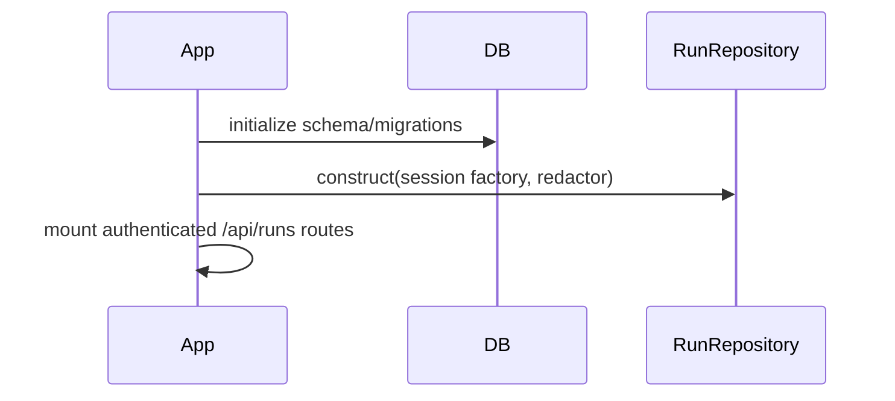
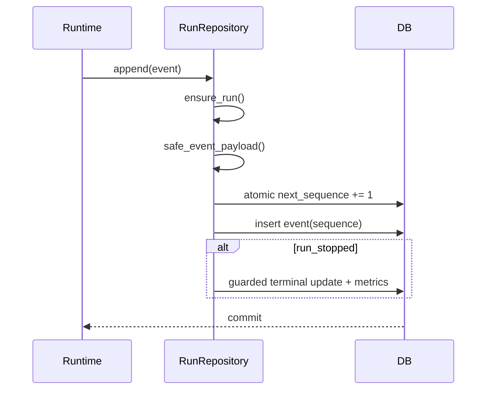
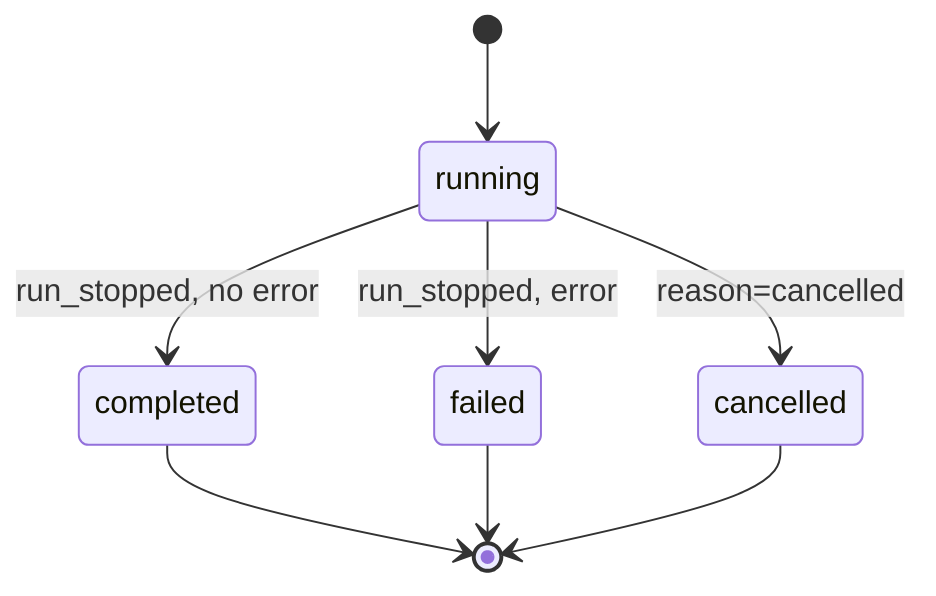

# Module 07 — Durable Run Ledger, replay, fork, and compare

**Status:** implemented; executable resume/workspace restoration partial

## Beginner explanation

A chat answer alone cannot explain what an agent did. The Run Ledger stores an ordered, owner-scoped trajectory: policy decisions, tool metadata, evidence IDs, token totals, stop reason, lineage, and bounded display metadata. Replay reads stored facts; fork copies safe conversation state at an event boundary; compare places two stored trajectories side by side. None reruns a model or tool.

## Prerequisites

Transactions, append-only logs, sequence numbers, pagination, ownership, redaction, and terminal states. Read [Run Ledger](../../concepts/run-ledger.md), [replay/fork/compare](../../concepts/replay-fork-compare.md), and [checkpoints](../../concepts/checkpoints.md).

## Learning outcomes

You can explain linearizable sequence allocation, terminal finalization, payload allowlisting, replay/fork/compare semantics, retention, and lineage limitations.

## Problem and mental model

The ledger is a flight recorder. `RunRow` is the flight summary; `RuntimeEventRow` records ordered instrument readings. It deliberately stores hashes, IDs, counts, and decisions rather than prompts, chain-of-thought, tool arguments, or results.

## Architecture

```mermaid
flowchart LR
  R[Runtime events] --> CR[ConversationRepository.append_runtime_event]
  CR --> RR[RunRepository]
  RR --> RUN[(RunRow)]
  RR --> EVT[(RuntimeEventRow)]
  API[/api/runs] --> RR
  API --> REPLAY[stored trajectory]
  API --> FORK[checkpoint + new conversation]
  API --> CMP[deterministic views]
```

## Startup sequence



## Per-request sequence



## State and lineage



A fork creates a durable `RunCheckpointRow`, a new conversation with redacted messages through the selected event timestamp, and a `ForkDraftRow`. The first child run consumes that draft and records `parent_run_id` and `fork_source_sequence`. `workspace_restoration` remains `none`.

## Source symbols to inspect

- `backend/app/services/run_ledger.py`: `SCHEMA_VERSION`, `_SAFE_FIELDS`, `safe_event_payload`, `RunRepository.ensure_run`, `append`, `events`, `fork`, `prune_completed`.
- `backend/app/routes/runs.py`: `_trajectory`, `get_run`, `get_run_events`, `compare_runs`, `fork_run`.
- `backend/app/runtime/run_models.py`: `RunRecord`, `RunEventRecord`, page types.
- `backend/alembic/versions/20260826_03_run_ledger.py`, `20260826_04_run_checkpoints.py`, `20260826_07_run_parent_fk.py`.

## Tests and evidence

- `backend/tests/unit/test_run_ledger.py`: concurrent contiguous sequences, owner scope, allowlist/redaction, terminal races, retention, malformed data.
- `backend/tests/integration/test_run_replay_api.py` and `test_run_fork_compare.py`: authenticated stored replay/fork/compare.
- `backend/tests/unit/test_run_lineage.py`: concurrent idempotent child lineage.
- `docs/evidence/local-portfolio-benchmark.json`: terminal grounded-run event evidence; explicitly deterministic local control-plane evidence.

## Executable exercise

```bash
cd backend
uv run pytest -q tests/unit/test_run_ledger.py
uv run pytest -q tests/integration/test_run_replay_api.py tests/integration/test_run_fork_compare.py
```

Inspect `test_concurrent_append_is_unique_contiguous_and_restart_safe`; explain why updating `next_sequence` with `RETURNING` and inserting in one transaction is stronger than `max(sequence)+1`.

## Security and failure modes

- Every read filters by owner; foreign and absent IDs are intentionally indistinguishable.
- Unknown event kinds, fields, schema versions, and malformed JSON fail closed.
- The allowlist excludes raw text/arguments/results/chain-of-thought; redaction is a second boundary.
- Appends after a terminal transition fail. Retention removes whole terminal trajectories, never partial active runs.
- Forked messages are redacted and bounded, but they are plaintext conversation rows; fork does not reproduce external side effects or filesystem state.

## Observability and evidence path

Use `/api/runs/{id}`, `/events`, `/children`, and `/compare`, plus persisted status, sequence, tokens, latency, cost, hashes, and correlation ID. The ledger is itself evidence, while logs are operational signals. An event’s presence proves the application recorded it, not that a provider’s semantic answer was correct.

## Lab versus production

SQLite and PostgreSQL transaction paths are implemented/tested; local evidence demonstrates deterministic behavior. There is no signed/WORM audit store, cross-region replication, arbitrary workspace restoration, or automatic executable resume. Compare exposes stored safe fields and `settings: null`; it is not causal attribution.

## Interview answer

“Archon’s Run Ledger is an owner-scoped append-only event repository. A guarded row update allocates contiguous sequence numbers and the terminal event atomically freezes status and usage. Payloads are event-specific allowlists plus redaction, so replay does not expose prompts or tool results. Replay is read-only, fork snapshots safe conversation state and records lineage, and compare deterministically contrasts stored trajectories. It does not rerun side effects or restore workspaces.”

## Self-check

1. Why is replay safer than re-execution?
2. How does sequence allocation survive concurrent appends?
3. Which data is intentionally absent from event payloads?
4. What exactly does a fork restore?
5. Why must retention delete a complete terminal trajectory?

## Done criteria

You can run the tests, trace one event from runtime to API, distinguish replay/fork/compare, explain terminal race handling, and state the executable-resume limitation.

Next: [Run Ledger walkthrough](../../code-walkthroughs/run-ledger.md) and [Module 08](../08-rag-grounding/README.md).
