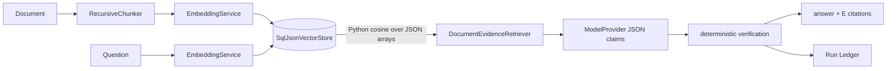
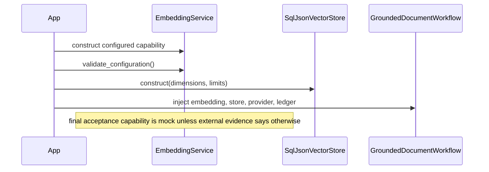
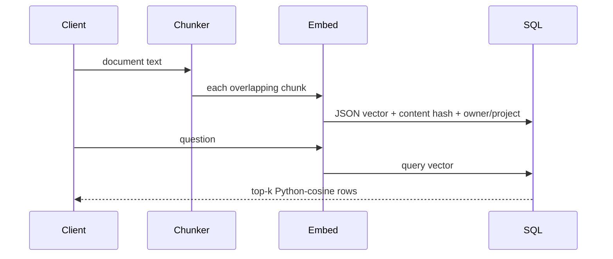
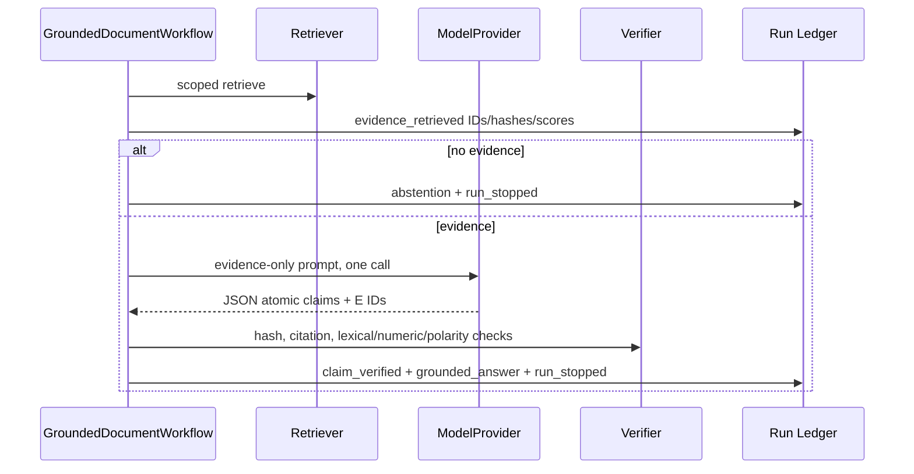

# Module 08 — Documents, embeddings, RAG, and grounded answers

> **Documentation status:** Draft
> **Capability status:** local grounded workflow implemented; external provider/embedding acceptance partial

## Beginner explanation

RAG retrieves document chunks before asking a model to answer. An embedding maps text to numbers; retrieval ranks chunks by similarity; generation writes claims from those chunks; verification decides whether each claim has conservative support; citations point back to evidence. A similar chunk is not proof that an answer is true.

## Prerequisites

Documents/chunks, vectors and cosine similarity, model calls, JSON, hashes, owner/project scope. Read [chunking](../../concepts/chunking.md), [embeddings](../../concepts/embeddings.md), [retrieval](../../concepts/retrieval.md), [RAG](../../concepts/rag.md), [groundedness](../../concepts/groundedness.md), [faithfulness](../../concepts/faithfulness.md), and [citations](../../concepts/citations.md).

## Learning outcomes

You can trace ingest/query, name the actual storage backend, separate five quality dimensions, explain deterministic claim checks, and interpret mock evidence honestly.

## Precision vocabulary

| Dimension | Question | Archon signal |
|---|---|---|
| Retrieval relevance | Did search return useful chunks for the query? | cosine `score`; not truth |
| Groundedness | Are answer claims attached to retrieved evidence and accepted? | `grounded`, supported/unsupported counts |
| Faithfulness | Does answer content stay entailed by supplied context? | conservative lexical/numeric/polarity check; legacy heuristic evaluator is weaker |
| Citation correctness | Does each citation exist and support its specific claim? | known `E#`, content hash, `_supports_claim` |
| Answer relevance | Does the answer address the user’s question? | separate heuristic/eval; not inferred from citations |

## Mental model

Retrieval is a librarian, generation is a writer, verification is a fact checker, and citations are shelf labels. One role cannot substitute for another.

## Architecture



**The implemented durable retrieval backend is SQL JSON storage with cosine similarity computed in Python (`backend = "sql-json-cosine"`). It is not pgvector.** Compatibility aliases do not change that fact.

## Startup sequence



## Ingest and request sequences





## Source symbols to inspect

- `backend/app/services/chunker.py`: `RecursiveChunker`, `EmbeddingService`, `validate_embedding`, `canonical_content_hash`.
- `backend/app/services/sql_json_vector_store.py`: `SqlJsonVectorStore.add_chunks`, `search`, `backend`.
- `backend/app/services/rag_pipeline.py`: `RAGPipeline` (simpler legacy path).
- `backend/app/services/grounded_rag.py`: `DocumentEvidenceRetriever`, `GroundedDocumentWorkflow.run`, `_prompt`, `_parse_claims`, `_verify_document_claims`, `_supports_claim`.
- `backend/app/services/documents.py`: durable document ingestion lifecycle.

## Tests and evidence

- `backend/tests/unit/test_rag.py`: chunking/mock embeddings/basic in-memory RAG.
- `backend/tests/unit/test_pgvector_store.py`: historical filename; assertions exercise SQL JSON behavior—do not call it pgvector.
- `backend/tests/unit/test_grounded_rag.py`: claim/citation filtering, corruption, abstention, owner scope, ledger, cancellation.
- `backend/tests/unit/test_embedding_hardening.py` and `test_embedding_config.py`: endpoint/vector/config boundaries.
- `backend/tests/integration/test_durable_documents.py`: durable scoped ingestion.
- `docs/evidence/local-portfolio-benchmark.json`: mock provider/embedding control-plane scenario, explicitly not model-quality proof.

## Executable exercise

```bash
cd backend
uv run pytest -q tests/unit/test_rag.py tests/unit/test_grounded_rag.py
uv run pytest -q tests/unit/test_embedding_hardening.py tests/integration/test_durable_documents.py
```

Classify each assertion in `test_supported_claim_is_answered_with_verified_citation`: retrieval relevance, groundedness, citation correctness, or provider-call accounting. Note what it does **not** prove about real semantic quality.

## Security and failure modes

Scope predicates apply before candidates are loaded. Stored content hashes are recomputed and compared; corrupt rows are skipped without leaking their contents. Embedding endpoints require HTTPS, allowlisted hosts, DNS checks, no redirects/proxy environment, dimension/finite-value validation. Unknown/missing citations and unsupported/negated/numerically inconsistent claims are removed. Retrieval/provider errors finalize a sanitized failed run; cancellation finalizes cancelled and is re-raised.

## Observability and evidence path

The ledger stores evidence/document/chunk IDs, content hashes, scores, counts, claim hashes, citation IDs, provider usage, stop reason, and latency—never raw quotes/answers in event payloads. `rag_query_complete` and corruption warnings expose safe counters. Evidence proves deterministic control flow and filtering, not real-world answer accuracy.

## Lab versus production

The final benchmark uses fake provider output and deterministic mock embeddings. Those are repeatable fixtures, not proof of embedding relevance or model quality. Python cosine scans a bounded candidate set and is not an indexed vector service; scale, recall, reranking, live-provider latency, and production corpus quality remain unverified. The deterministic verifier is conservative lexical/numeric/polarity logic, not semantic NLI.

## Interview answer

“Archon ingests overlapping chunks, validates embeddings, and stores JSON vectors in SQL. Query retrieval is owner/project scoped and computes cosine similarity in Python—not pgvector. The grounded workflow asks for atomic JSON claims with evidence IDs, rejects unknown or weakly supported claims using hash, lexical, number, and polarity checks, then records safe evidence metadata in the Run Ledger. Tests prove control invariants with mocks; they do not establish live model or retrieval quality.”

## Self-check

1. Why is cosine score not groundedness?
2. What is the actual vector backend?
3. How does citation correctness differ from answer relevance?
4. Why does a deterministic mock embedding not prove semantic recall?
5. What happens on no evidence, corrupt evidence, and cancellation?

## Done criteria

You can run the tests, trace ingest/query, label all five quality dimensions correctly, cite the SQL JSON implementation, and bound every provider-quality claim.

Next: [grounded RAG walkthrough](../../code-walkthroughs/grounded-rag.md) and [Module 09](../09-evaluation-harness/README.md).
