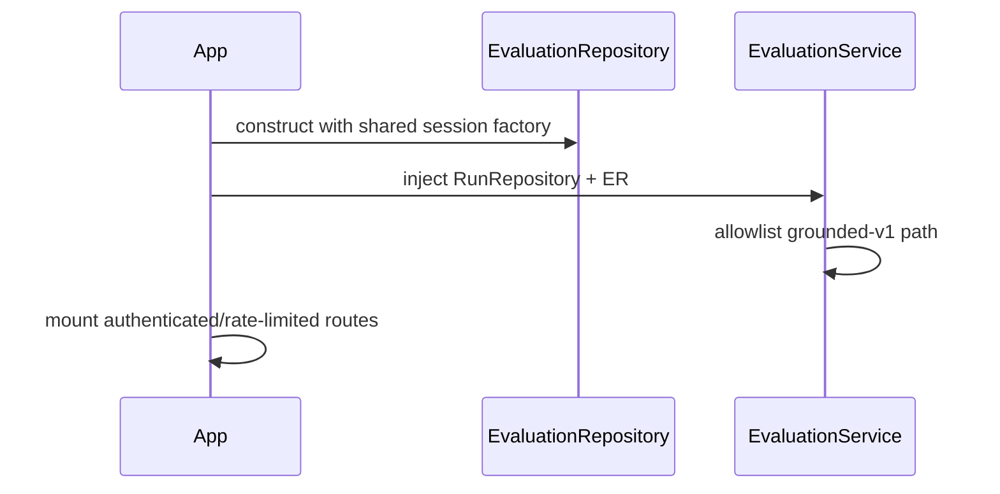
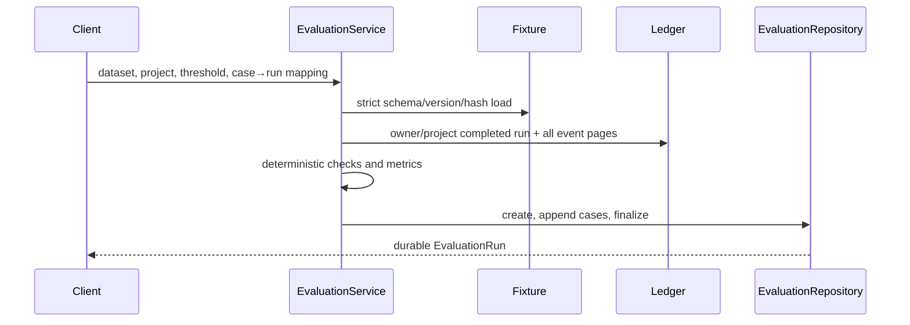
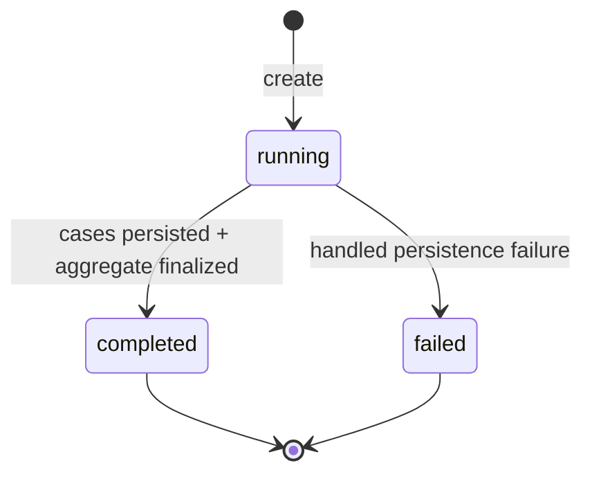

# Module 09 — Evaluation harness and regression evidence

**Status:** implemented recorded-run evaluation; model-quality evidence limited

## Beginner explanation

An evaluation turns examples and expectations into repeatable measurements. Archon has a lightweight live-call `EvalHarness`, heuristic evaluators, and a stronger durable path that evaluates already-completed Run Ledger trajectories against a versioned, hash-verified dataset. The durable path does not call a model, retriever, or tool.

## Prerequisites

Datasets, test fixtures, metrics, thresholds, Run Ledger events, ownership, and regression testing. Read [evaluation harness](../../concepts/evaluation-harness.md), [datasets](../../concepts/datasets.md), plus RAG quality concepts from Module 08.

## Learning outcomes

You can design immutable fixtures, map runs to cases, interpret scores and aggregates, compare evaluations, identify metric validity limits, and avoid treating deterministic fixtures as model-quality proof.

## Problem and mental model

A test harness is a ruler. A versioned dataset says what is measured; an evaluator defines marks on the ruler; persistence makes results auditable; a threshold is a policy decision. A precise ruler can consistently measure the wrong thing, so validity must be argued separately from reproducibility.

## Architecture

```mermaid
flowchart LR
  F[grounded-v1.json] --> L[load_evaluation_fixture]
  L --> S[EvaluationService]
  R[(completed Run Ledger runs)] --> S
  S --> C[deterministic checks/metrics]
  C --> P[(EvaluationRepository)]
  API[/api/evals] --> S
  P --> CMP[compare metric deltas]
```

## Startup sequence



## Per-evaluation sequence



## State model



## Metrics without category errors

Recorded-run evaluation derives support/citation/unsupported rates from safe events and checks bounded `answer_summary` substrings. It does not recompute semantic entailment. Retrieval relevance, groundedness, faithfulness, citation correctness, and answer relevance remain distinct. `evaluate_faithfulness` and `evaluate_relevance` in `evaluators.py` are keyword heuristics; comments describing “production evaluators” do not make them validated judges.

## Source symbols to inspect

- `backend/app/eval/fixtures.py`: `EvaluationFixture`, `load_evaluation_fixture`, `fixture_content_hash`.
- `backend/app/eval/datasets/grounded-v1.json`: shipped immutable dataset.
- `backend/app/eval/service.py`: `EvaluationService.evaluate`, `_stored_events`, `_evaluate_case`, `_aggregate`, `compare`.
- `backend/app/eval/persistence.py`: durable evaluation records/cases.
- `backend/app/routes/evaluations.py`: `RecordedEvaluationRequest`, `create_recorded_evaluation`, compare/list/get.
- `backend/app/eval/harness.py`: `EvalHarness` legacy/live-call exact/contains/latency harness.
- `backend/app/eval/evaluators.py`: heuristic `evaluate_faithfulness`, `evaluate_relevance`, `evaluate_safety`, `evaluate_cost`.

## Tests and evidence

- `backend/tests/unit/test_recorded_evaluations.py`: good/bad trajectories, paging, scope, persistence/restart, safe failure.
- `backend/tests/unit/test_evaluation_fixtures.py`: exact schema/version/hash rejection.
- `backend/tests/integration/test_recorded_evaluation_api.py`: authenticated API lifecycle.
- `backend/tests/unit/test_eval.py`: lightweight harness.
- `backend/tests/unit/test_evaluation_persistence.py`: durable records.
- `docs/evidence/local-portfolio-benchmark.json`: deterministic fixtures/control-plane only; no external model/network.

## Executable exercise

```bash
cd backend
uv run pytest -q tests/unit/test_evaluation_fixtures.py tests/unit/test_recorded_evaluations.py
uv run pytest -q tests/integration/test_recorded_evaluation_api.py
```

Read `grounded-v1.json`, then explain why changing one expectation without updating `content_hash` is rejected and why mapping each case key exactly once prevents positional mistakes.

## Security and failure modes

Dataset IDs are allowlisted; exact schemas, unique case keys, bounds, versions, and SHA-256 identities reject drift. Source runs must be owner/project-visible and completed. Evaluation persistence excludes raw answer/evidence payloads. Partial persistence is finalized `failed` when possible. Risks remain: answer-summary substring gaming, stale/biased datasets, thresholds chosen after results, and metric aggregation hiding subgroup failures.

## Observability and evidence path

Every durable result stores dataset ID/version/hash, source run IDs, threshold, per-case checks/metrics, status, and aggregates. Compare reports numeric `b-a` deltas. Reproduce a claim by resolving evaluation → fixture hash → source run → safe events → calculation. Logs alone are not the evaluation record.

## Lab versus production

Recorded-run evals are real, durable, scoped, and deterministic. Their current two-case fixture and synthetic recorded trajectories are regression evidence, not proof that a live model answers users well. No representative production dataset, human annotation agreement, calibrated semantic judge, live-provider acceptance, or deployment promotion gate is established.

## Interview answer

“Archon evaluates completed, owner/project-scoped Run Ledger runs without invoking runtime dependencies. A strict allowlisted fixture has an exact schema, semantic version, and canonical content hash; every case maps to one unique completed run. The service pages all safe events, computes deterministic checks and rates, persists case results and aggregates, and supports comparison. This is strong reproducibility and regression evidence, but deterministic fixtures and substring checks are not model-quality proof.”

## Self-check

1. Why hash a dataset’s canonical body?
2. Why reject active source runs?
3. What can `citation_rate` prove and not prove?
4. How do recorded-run evaluation and `EvalHarness` differ?
5. Why can a perfectly reproducible fixture still lack validity?

## Done criteria

You can execute the tests, reconstruct one score, explain dataset identity and owner scope, compare two evaluations, and state the evidence limitation explicitly.

Next: [evaluation harness walkthrough](../../code-walkthroughs/evaluation-harness.md) and [Module 10](../10-resilience/README.md).
