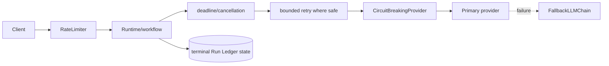
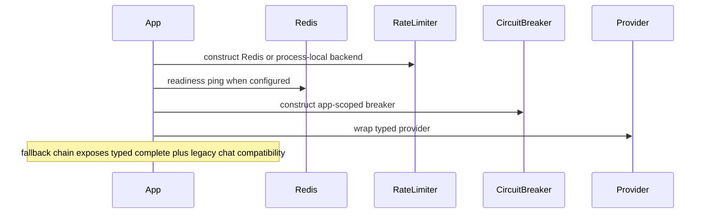
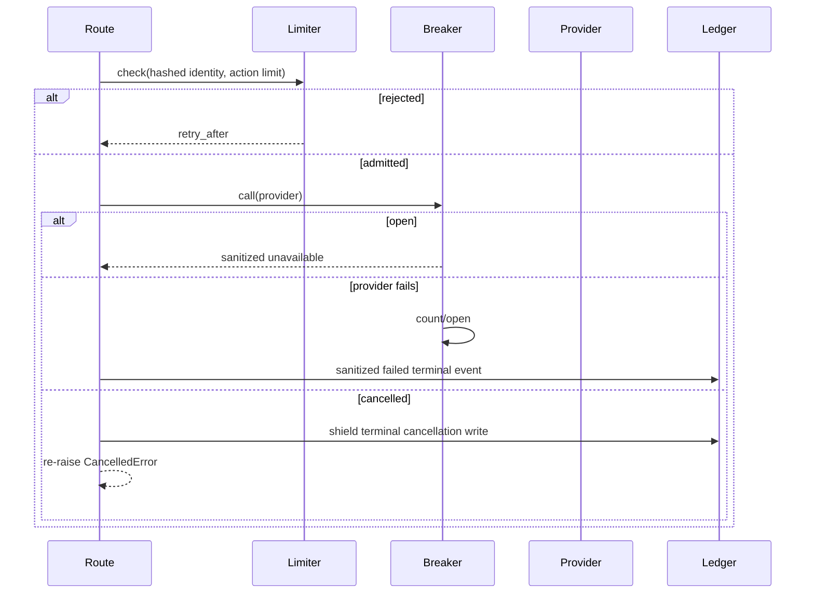
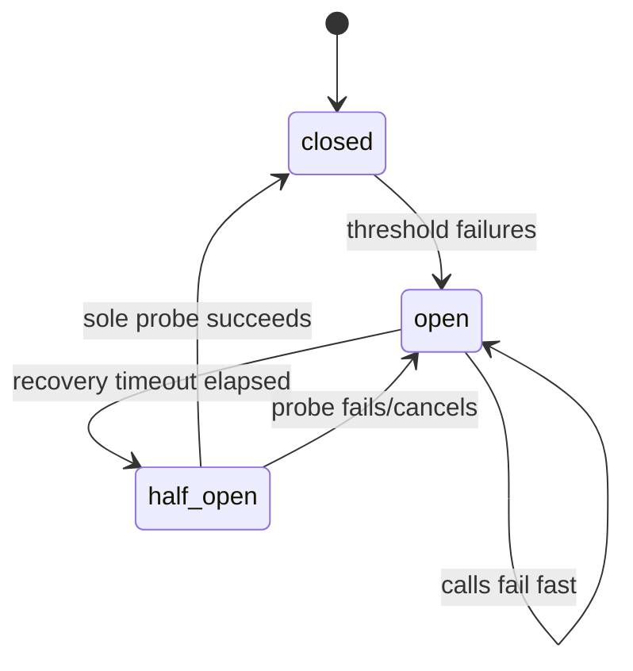

# Module 10 — Resilience: idempotency, retries, deadlines, breakers, fallback, and rate limits

> **Documentation status:** Draft
> **Capability status:** selected resilience controls implemented with explicit integration and semantics limits

## Beginner explanation

Failures are normal: providers time out, clients disconnect, retries duplicate work, and traffic spikes. Resilience means bounding damage and preserving a truthful terminal state—not merely “trying again.” Archon demonstrates idempotent creation/finalization guards, bounded retries in selected paths, timeout/cancellation handling, a concurrency-safe circuit breaker, fallback adapters, and sliding-window rate limiting.

## Prerequisites

Async tasks/exceptions, side effects, transactions, distributed state, monotonic clocks, and provider interfaces. Read [idempotency](../../concepts/idempotency.md), [retries, timeouts, and cancellation](../../concepts/retries-timeouts-cancellation.md), [circuit breaker](../../concepts/circuit-breaker.md), [fallback](../../concepts/fallback.md), and [rate limiting](../../concepts/rate-limiting.md).

## Learning outcomes

You can choose safe retry boundaries, propagate cancellation, explain breaker transitions/races, verify typed fallback contract preservation, distinguish local from Redis limits, and run a deterministic failure drill.

## Problem and mental model

Use layered bulkheads: idempotency prevents duplicate state; deadlines bound time; cancellation stops unwanted work and finalizes evidence; retries handle classified transient failures within a budget; a breaker stops hammering an unhealthy dependency; fallback changes the service path; rate limiting controls admission. Each layer has different semantics.

## Architecture



Do not assume every box wraps every live route. Verify wiring for the path being claimed.

## Startup sequence



## Failure request sequence



## Circuit state model



## Source symbols to inspect

- `backend/app/security/circuit_breaker.py`: `CircuitBreaker.call`, `_abandon_probe`, `CircuitBreakingProvider.complete`.
- `backend/app/security/rate_limiter.py`: `RateLimiter.check`, `_check_redis`, `_check_redis_transaction`, `_check_local`.
- `backend/app/agents/fallback_chain.py`: `FallbackLLMChain.complete`, capability filtering, typed exhaustion, and legacy-compatible `chat`.
- `backend/app/agents/resilient_coordinator.py`: `ResilientCoordinator._execute_with_fallback` (bounded attempts/timeout, but unsafe validation fallback and unenforced pre-call token budget).
- `backend/app/services/grounded_rag.py`: cancellation shielding and terminal finalization.
- `backend/app/services/run_ledger.py`: idempotent `ensure_run`, guarded terminal update, fork checkpoint identity.
- `backend/app/tools/registry.py`: `SecureToolRegistry.execute` timeout boundary.

## Tests and evidence

- `backend/tests/security/test_pii_circuit_breaker.py`: threshold, fail-fast, one half-open probe, stale success, cancelled probe.
- `backend/tests/unit/test_rate_limiter.py`: local/Redis bounds, concurrency, fail-closed Redis errors, hashed IDs.
- `backend/tests/unit/test_fallback_wire.py`: primary/secondary/all-fail behavior and factory wiring.
- `backend/tests/unit/test_run_ledger.py`: idempotent/terminal/race invariants.
- `backend/tests/unit/test_grounded_rag.py::test_cancellation_finalizes_cancelled_run_and_reraises`.
- `backend/tests/unit/test_tools.py::TestToolTimeout::test_timeout_enforcement`.
- `docs/evidence/local-portfolio-benchmark.json`: ten deterministic provider-resilience iterations; no external provider.

## Executable failure drill

```bash
cd backend
uv run pytest -q tests/security/test_pii_circuit_breaker.py tests/unit/test_rate_limiter.py
uv run pytest -q tests/unit/test_fallback_wire.py \
  tests/unit/test_grounded_rag.py::test_cancellation_finalizes_cancelled_run_and_reraises
```

For each passing test, write the protected invariant and the residual risk. Example: “one half-open probe” prevents a recovery stampede; it does not prove cross-process breaker coordination because breaker state is app-process memory.

## Security and failure modes

- Retry only transient, side-effect-safe operations; retry counts are budgets, not guarantees. There is no universal retry wrapper.
- Timeout must cover the operation and cleanup; cancellation must be re-raised after shielded terminal cleanup.
- Breaker errors are sanitized. Its state is process-local and not a distributed health oracle.
- `FallbackLLMChain` preserves typed requirements and metadata only when one candidate supports the full contract; it raises typed errors instead of silently degrading to text.
- `ResilientCoordinator`’s validation fallback says approved and its token budget records after calls; treat it as a prototype, not a security boundary.
- Redis limiter is shared/atomic; local mode is process-local. Redis failures do not silently fall back locally.

## Observability and evidence path

Inspect `circuit_breaker_opened/rejected/reset`, `llm_adapter_failed`, `llm_fallback_success`, `rate_limit_exceeded`, timeout logs, limiter counters/retry-after, breaker `get_stats`, and terminal ledger status. Logs sanitize exceptions on hardened paths. Couple every alert with scope: provider, process, owner/action bucket, attempt, deadline, and terminal run ID.

## Lab versus production

The deterministic benchmark proves state transitions and secondary selection under injected failures. It does not show recovery against a real provider, multi-instance breaker state, production traffic fairness, or an SLO. Redis-backed limiting is the multi-process target; local mode is for development. Typed fallback contract preservation is tested, while live cross-provider semantic parity remains partial.

## Interview answer

“Archon layers admission control, deadlines/cancellation, selective retries, an app-scoped circuit breaker, and typed fallback. The breaker is lock-protected, admits one half-open probe, ignores stale success after a concurrent open, and sanitizes provider errors. The fallback chain requires one candidate to preserve the complete tools/images/JSON contract and raises typed errors rather than returning outage text. Redis sliding windows are atomic and hash identifiers; local mode is process-local. I still would not claim live provider parity or universal resilience.”

## Self-check

1. Why can retrying a write be unsafe without idempotency?
2. How does cancellation differ from timeout?
3. Why admit only one half-open probe?
4. Why must one fallback candidate satisfy the complete tools/images/JSON contract?
5. Why must Redis failure not silently use a local limiter?

## Done criteria

You can run the drill, diagram breaker transitions, identify retry/idempotency boundaries, demonstrate cancellation evidence, and separate deterministic control proof from production SLO proof.

Continue with the [resilience walkthrough](../../code-walkthroughs/resilience.md).
