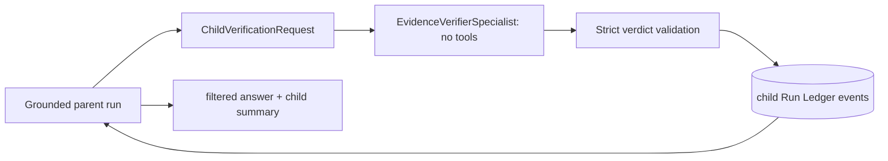
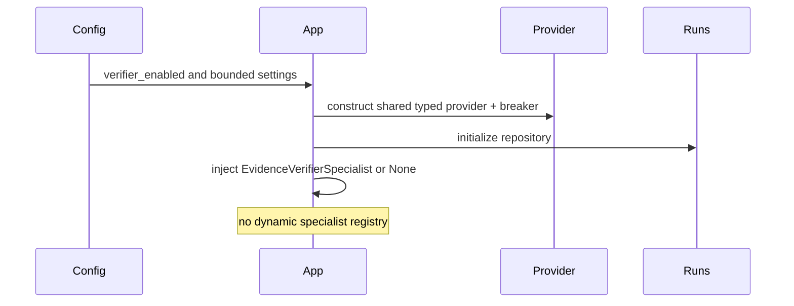
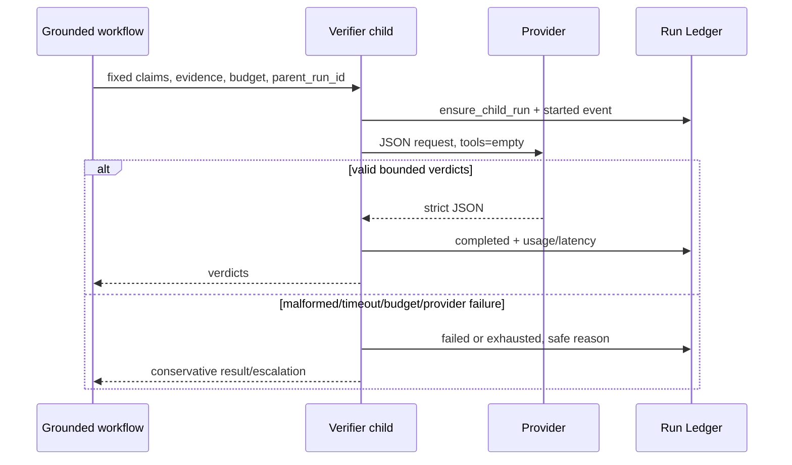
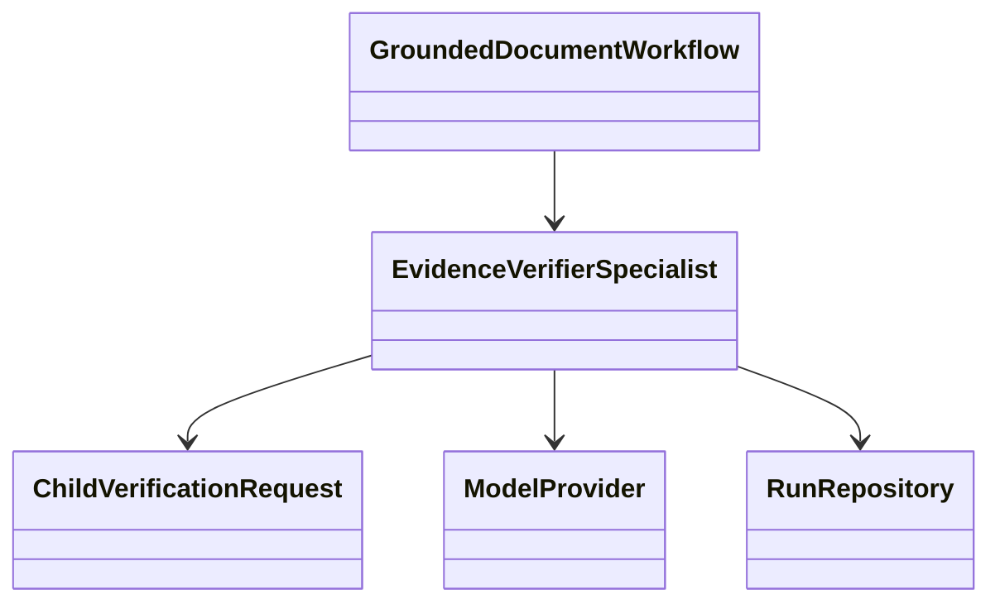
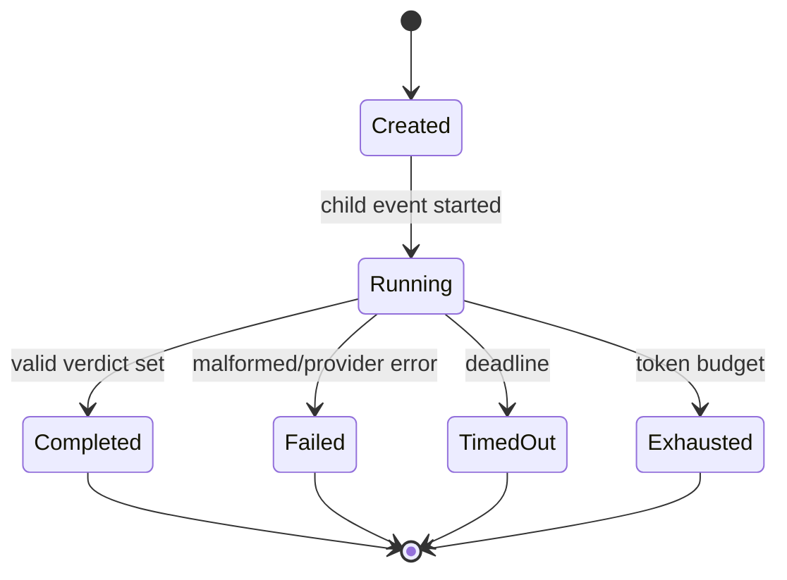

# Module 11 — Bounded verifier delegation

> **Documentation status:** Draft
> **Estimated time:** 90 minutes
> **Canonical concepts:** [bounded-delegation](../../concepts/bounded-delegation.md), [verifier-child](../../concepts/verifier-child.md), [parent-child-lineage](../../concepts/parent-child-lineage.md)

## Why this module exists

A second model can add cost and authority without adding trust. This module shows the narrower useful design Archon actually implements: one evidence-only, no-tools verifier child with finite budgets and durable lineage. You will produce a parent-child evidence graph and explain why it is neither a swarm nor generic self-reflection.

## Beginner explanation

Archon delegates only evidence review, not open-ended work. The child sees a sealed claim/evidence packet and has no tools. Code deterministically validates that boundary and output schema; the verdict inside it is model-generated and can still be wrong.

## Prerequisites and vocabulary

### Learn first

- [Module 08: grounded RAG](../08-rag-grounding/README.md) — claims, evidence and deterministic grounding.
- [Module 09: evaluation](../09-evaluation-harness/README.md) — versioned measurement and honest quality claims.

### Vocabulary

| Term | Beginner definition | Canonical source |
|---|---|---|
| delegation | A parent assigns a finite task to a child. | [bounded-delegation](../../concepts/bounded-delegation.md) |
| verdict | A typed supported, rejected, or escalate result for one claim. | [verifier-child](../../concepts/verifier-child.md) |
| lineage | A durable `parent_run_id` edge between run records. | [parent-child-lineage](../../concepts/parent-child-lineage.md) |
| budget | An enforced maximum for input/output tokens, time, and retries. | [bounded-delegation](../../concepts/bounded-delegation.md) |

## Learning outcomes

After this module, the learner can:

1. construct and validate the child request boundary;
2. trace one child from grounded workflow through ledger events;
3. explain malformed-output, timeout, and escalation behavior;
4. measure benefit without claiming semantic truth or a swarm;

## Problem and mental model

Use a sealed review packet. The parent supplies exact claims and evidence IDs; the child cannot fetch more evidence or use tools. The model output is untrusted until strict parsing proves every claim appears exactly once and every cited evidence ID was delegated. The invariant is bounded authority, not model infallibility.

The connection to the course spine is explicit: **Policy → Run → Approval → Tool → Evidence → Evaluation**. Inputs are authenticated/scoped data; outputs are typed results plus inspectable evidence; mutable authority never comes from model prose.

## Architecture and components



### Component responsibilities

| Component | Responsibility | Must not be assumed |
|---|---|---|
| Grounded workflow | Select claims/evidence and consume verdicts conservatively. | A child verdict replaces deterministic grounding. |
| Verifier specialist | Call one model with no tools and enforce budgets/schema. | The model judgment is deterministic. |
| Run repository | Create scoped child lineage and ordered lifecycle events. | Lineage proves benefit or causality. |
| Measurement fixture | Compare a versioned baseline and child result. | Fixture performance generalizes to production. |

## Startup sequence



Verifier startup validates finite settings, reuses the app-scoped circuit-broken provider and run repository, and injects either one `EvidenceVerifierSpecialist` or `None`. Disabled mode remains explicit.

## Per-request sequence



The alternate path is part of the design: denial, stale state, malformed input, timeout, cancellation, or dependency error produces a stable bounded result/evidence rather than invented success.

## Class and dependency view



The implementation favors dependency injection and composition. The arrows show use, not inheritance.

## State and lifecycle



Only source-defined statuses/events are evidence. A transient UI state must not overwrite a durable terminal state.

## Source walkthrough

| Order | Source symbol | Why inspect it | Implementation status/boundary |
|---:|---|---|---|
| 1 | [`backend/app/delegation/models.py:ChildVerificationRequest / VerificationBudget`](../../../../backend/app/delegation/models.py) | Strict no-tools, IDs, evidence subset, finite budgets. | `implemented` within stated boundary |
| 2 | [`backend/app/delegation/service.py:EvidenceVerifierSpecialist.verify`](../../../../backend/app/delegation/service.py) | Creates one child, calls provider, validates output, records lifecycle. | `implemented` within stated boundary |
| 3 | [`backend/app/services/grounded_rag.py:GroundedDocumentWorkflow._verify_with_child`](../../../../backend/app/services/grounded_rag.py) | Live parent integration and conservative result use. | `implemented` within stated boundary |
| 4 | [`backend/app/services/run_ledger.py:RunRepository.ensure_child_run`](../../../../backend/app/services/run_ledger.py) | Durable owner/project parent-child edge. | `implemented` within stated boundary |
| 5 | [`backend/app/delegation/measurement.py:measure_verifier_benefit`](../../../../backend/app/delegation/measurement.py) | Deterministic baseline-versus-child measurement. | `implemented` within stated boundary |

### Tests to inspect

| Test | Contract proved | What it does not prove |
|---|---|---|
| [`backend/tests/unit/test_delegation_contract.py`](../../../../backend/tests/unit/test_delegation_contract.py) | request/output schemas reject authority expansion. | Does not prove public deployment, external-provider parity, or production scale. |
| [`backend/tests/unit/test_evidence_verifier.py`](../../../../backend/tests/unit/test_evidence_verifier.py) | budgets, retries, malformed output and durable lifecycle. | Does not prove public deployment, external-provider parity, or production scale. |
| [`backend/tests/integration/test_verifier_benefit.py`](../../../../backend/tests/integration/test_verifier_benefit.py) | bounded fixture measurement on integrated path. | Does not prove public deployment, external-provider parity, or production scale. |
| [`backend/tests/integration/test_run_parent_migration.py`](../../../../backend/tests/integration/test_run_parent_migration.py) | parent_run_id persistence and schema migration. | Does not prove public deployment, external-provider parity, or production scale. |

## Try it: bounded exercise

### Goal

Run the focused contract set and turn each passing test into one precise claim plus one limitation.

### Safety and setup

- Working directory starts at repository root; backend dependencies must be installed with `uv`.
- The focused set uses fixtures/local state. Do not insert real credentials or point fixtures at external services.
- Side effects are test databases/processes cleaned by fixtures; if interrupted, remove only resources you created.

### Steps

```bash
cd backend
uv run pytest -q tests/unit/test_delegation_contract.py tests/unit/test_evidence_verifier.py tests/integration/test_verifier_benefit.py
```

Create a two-column note: **proved invariant** and **not proved**. Include at least one security invariant, one failure path, and one evidence path.

### Done criteria

- [ ] Every focused test passes, or a real environment blocker is recorded without fabricating output.
- [ ] At least three results are tied to exact symbols and assertions.
- [ ] The learner states the local/provider/deployment boundary aloud.
- [ ] Temporary resources are absent or explicitly cleaned.

## Security and failure modes

| Threat or failure | Boundary/control | Failure behavior | Residual risk |
|---|---|---|---|
| Invented evidence ID | Subset validation | Malformed response fails; no verdict accepted | Model can still misjudge supplied evidence. |
| Tool/recursive authority | Request requires empty tools; one wired specialist | Construction rejects tools | Prompt isolation is not a process sandbox. |
| Timeout/provider failure | Finite timeout and at most one configured retry | Terminal child evidence and conservative parent handling | External provider behavior was not finally verified. |
| Cross-owner lineage | Parent/child carry user and project | Scoped ledger reads/writes | Database privileges still matter. |

Also review concurrent child creation, terminal-event races, claim-text redaction, and false-rejection cost whenever this path changes.

## Observability and evidence path

```text
correlation ID → authenticated owner/project → typed runtime event → redacted log + durable Run Ledger → metric/OTLP span/UI → evaluation
```

| Evidence | Link or command | Claim supported | Scope/limit |
|---|---|---|---|
| Canonical status | [Implementation evidence](../../../IMPLEMENTATION-EVIDENCE.md) | Separates exists/wired/tested/observed/UI/deployed. | Mutable evidence; inspect revision. |
| Architecture | [Architecture diagrams](../../../ARCHITECTURE-DIAGRAMS.md) | Wider component and trust boundaries. | Diagram is not runtime observation. |
| Focused tests | command above | Deterministic contracts and failure paths. | Fixture/local scope. |

Never expose credentials, raw provider exceptions, tool payloads, personal data, or hidden chain-of-thought as “evidence.”

## Lab vs production

| Dimension | Demonstrated in repository/lab | Required or unverified for production |
|---|---|---|
| Deployment | Local/test paths and artifacts. | Public ingress, multi-host operation, SLO/on-call; public deployment is deferred. |
| Data and scale | Bounded fixtures and local persistent data. | Capacity, retention, sustained load and multi-replica behavior. |
| Providers | Deterministic/mock/local dependencies as explicitly linked. | Final external providers were not verified. |
| Security/operations | Tested ownership, validation, policy and redaction controls. | Independent audit, rotation, production alerting and incident drills. |

Contract, integration, benchmark fixture, and local UI evidence establish one child. The final external providers were not verified. There is no dynamic swarm, recursive planner, generic reflection loop, or proof that the reviewer is always correct.

## Interview answer

### 30-second answer

> Archon uses one bounded verifier child only after grounded claim construction. It receives exact claims and evidence, no tools, and finite token/time/retry budgets. Strict parsing rejects unknown claims and evidence; child events persist under parent_run_id. Tests and a deterministic benefit fixture prove the control path, not model truth. External providers and swarms are not claimed.

### Deeper follow-ups

- **Why no tools?** Evidence review needs no new facts or side effects; tools would expand authority.
- **What is deterministic?** Request/result validation, budget enforcement and fail-closed handling—not model judgment.
- **How is benefit shown?** A versioned fixture compares outcomes and lineage without claiming universal quality.
- **What remains?** External-provider acceptance, representative quality sets, cost/latency objectives and multi-instance tests.

## Self-check

1. Why is this safer than giving a reviewer tools?
2. What prevents citation invention?
3. Where is lineage persisted?
4. Is retry always safe?
5. What does the benefit fixture prove?
6. Why is this not reflection or a swarm?

<details>
<summary>Answer guide</summary>

1. The child cannot expand context or create side effects; its authority is the sealed evidence packet.
2. Request/output validators require every verdict evidence ID to be a subset of IDs delegated for that claim.
3. RunRepository.ensure_child_run creates the child with parent_run_id and the same owner/project scope.
4. Only explicitly classified transient provider failure gets the tiny configured retry budget; malformed output is not made trustworthy by retries.
5. Deterministic control/measurement behavior and trade-offs, not external model quality or source truth.
6. It is one purpose-built post-generation evidence check; it neither generically critiques arbitrary reasoning nor dynamically creates agents.

</details>

## Further reading

- Canonical concepts: [bounded-delegation](../../concepts/bounded-delegation.md), [verifier-child](../../concepts/verifier-child.md), [parent-child-lineage](../../concepts/parent-child-lineage.md)
- [Implementation evidence](../../../IMPLEMENTATION-EVIDENCE.md)
- [Architecture diagrams](../../../ARCHITECTURE-DIAGRAMS.md)
- [Next step](../12-governed-mcp/README.md)

## Done criteria

You can draw startup, request, state and evidence flows; name exact source/test boundaries; run the exercise safely; explain security and failures; and distinguish implemented local evidence from deferred production claims.
