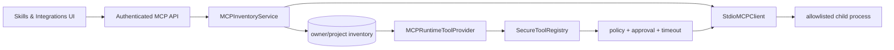
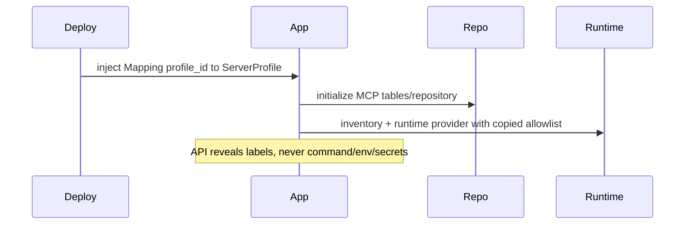
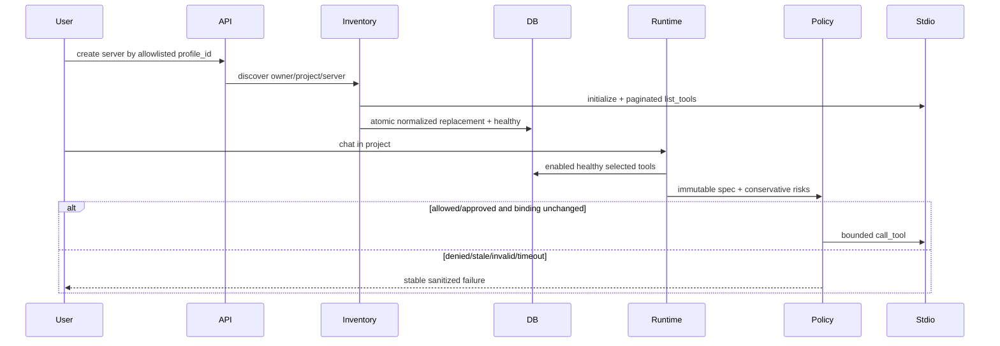
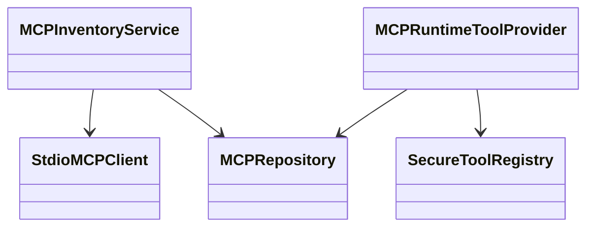
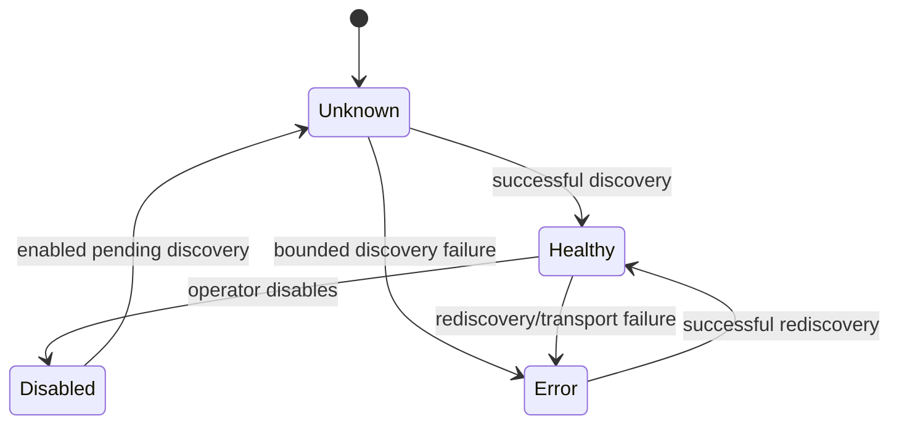

# Module 12 — Governed MCP discovery and execution

> **Documentation status:** Draft
> **Reviewed revision:** `3577b00` documentation review
> **Estimated time:** 110 minutes
> **Canonical concepts:** [mcp](../../concepts/mcp.md), [mcp-transports-inventory](../../concepts/mcp-transports-inventory.md), [authorization-ownership](../../concepts/authorization-ownership.md)

## Why this module exists

MCP makes tools portable, but portability is not trust. This module follows an allowlisted stdio server from discovery into durable inventory and then through owner scope, schema normalization, policy, optional approval, timeout, and execution. You will prove a discovered tool is not automatically authorized.

## Beginner explanation

MCP standardizes tool discovery and calls; it does not confer trust. Archon supports one concrete path: deployment-owned stdio profiles become scoped inventory, then immutable runtime bindings that still cross schema, policy, approval and timeout controls.

## Prerequisites and vocabulary

### Learn first

- [Module 04: tools and schemas](../04-tools-and-schemas/README.md) — validated tool contracts.
- [Module 05: policy and approvals](../05-policy-and-approvals/README.md) — action authorization.
- [Module 07: Run Ledger](../07-run-ledger/README.md) — durable event evidence and lineage.

### Vocabulary

| Term | Beginner definition | Canonical source |
|---|---|---|
| MCP | Protocol for discovering and invoking contextual capabilities. | [mcp](../../concepts/mcp.md) |
| stdio transport | Protocol messages over child-process standard input/output. | [MCP transports and inventory](../../concepts/mcp-transports-inventory.md) |
| profile | Deployment-owned command, arguments, environment and limits. | [mcp](../../concepts/mcp.md) |
| inventory | Persisted scoped server/tool metadata from bounded discovery. | [MCP transports and inventory](../../concepts/mcp-transports-inventory.md) |
| binding | Immutable request-scoped closure joining inventory to owner/project/profile. | [mcp](../../concepts/mcp.md) |

## Learning outcomes

After this module, the learner can:

1. separate protocol transport, inventory, runtime binding, and policy;
2. trace cursor-paginated stdio discovery;
3. show write/destructive MCP calls require the same policy/approval path;
4. state why HTTP/OAuth and arbitrary user commands are deferred;

## Problem and mental model

Think “controlled adapter pipeline,” not “install any plugin.” Operators own executable profiles; users select only safe profile IDs. Discovery imports bounded metadata. The runtime exposes enabled healthy tools only, revalidates the binding immediately before transport use, then sends it through SecureToolRegistry.

The connection to the course spine is explicit: **Policy → Run → Approval → Tool → Evidence → Evaluation**. Inputs are authenticated/scoped data; outputs are typed results plus inspectable evidence; mutable authority never comes from model prose.

## Architecture and components



### Component responsibilities

| Component | Responsibility | Must not be assumed |
|---|---|---|
| Stdio client | Bound protocol lifecycle, pagination, bytes, schemas and cleanup. | A local process is benign. |
| Inventory service/repository | Resolve profiles and atomically persist scoped metadata/health. | Discovery grants execution authority. |
| Runtime provider | Select enabled healthy tools and revalidate immutable bindings. | Stored health proves current reachability. |
| Secure registry | Apply schema, policy, approval, timeout and evidence controls. | MCP bypasses native-tool governance. |

## Startup sequence



Startup copies deployment-owned profiles into inventory/runtime services and initializes their repository. Public profile responses expose labels and IDs, never command arguments, environment values or secrets.

## Per-request sequence



The alternate path is part of the design: denial, stale state, malformed input, timeout, cancellation, or dependency error produces a stable bounded result/evidence rather than invented success.

## Class and dependency view



The implementation favors dependency injection and composition. The arrows show use, not inheritance.

## State and lifecycle



Only source-defined statuses/events are evidence. A transient UI state must not overwrite a durable terminal state.

## Source walkthrough

| Order | Source symbol | Why inspect it | Implementation status/boundary |
|---:|---|---|---|
| 1 | [`backend/app/mcp/client.py:StdioMCPClient`](../../../../backend/app/mcp/client.py) | Official SDK session, pagination, byte/time/name/schema bounds. | `implemented` within stated boundary |
| 2 | [`backend/app/mcp/inventory.py:MCPInventoryService.discover`](../../../../backend/app/mcp/inventory.py) | Allowlist resolution, scoped replacement, stable health/errors. | `implemented` within stated boundary |
| 3 | [`backend/app/mcp/repository.py:MCPRepository`](../../../../backend/app/mcp/repository.py) | Durable owner/project server and tool selection. | `implemented` within stated boundary |
| 4 | [`backend/app/mcp/runtime.py:MCPRuntimeToolProvider.for_scope`](../../../../backend/app/mcp/runtime.py) | Healthy selected tools, normalized schemas, immutable closures and revalidation. | `implemented` within stated boundary |
| 5 | [`backend/app/routes/chat.py:get_tool_registry`](../../../../backend/app/routes/chat.py) | MCP specs enter the ordinary secure registry/policy path. | `implemented` within stated boundary |
| 6 | [`backend/app/routes/mcp.py:router endpoints`](../../../../backend/app/routes/mcp.py) | Authenticated, rate-limited administration without profile secrets. | `implemented` within stated boundary |

### Tests to inspect

| Test | Contract proved | What it does not prove |
|---|---|---|
| [`backend/tests/integration/test_mcp_stdio.py`](../../../../backend/tests/integration/test_mcp_stdio.py) | real local official SDK client/server stdio exchange. | Does not prove public deployment, external-provider parity, or production scale. |
| [`backend/tests/integration/test_mcp_inventory.py`](../../../../backend/tests/integration/test_mcp_inventory.py) | scoped discovery, health and durable inventory. | Does not prove public deployment, external-provider parity, or production scale. |
| [`backend/tests/integration/test_mcp_runtime.py`](../../../../backend/tests/integration/test_mcp_runtime.py) | policy/approval execution and stale-binding rejection. | Does not prove public deployment, external-provider parity, or production scale. |
| [`backend/tests/integration/test_mcp_api.py`](../../../../backend/tests/integration/test_mcp_api.py) | authenticated owner-scoped administration. | Does not prove public deployment, external-provider parity, or production scale. |
| [`frontend/tests/mcp-integrations.spec.ts`](../../../../frontend/tests/mcp-integrations.spec.ts) | current integration UI flow. | Does not prove public deployment, external-provider parity, or production scale. |

## Try it: bounded exercise

### Goal

Run the focused contract set and turn each passing test into one precise claim plus one limitation.

### Safety and setup

- Working directory starts at repository root; backend dependencies must be installed with `uv`.
- The focused set uses fixtures/local state. Do not insert real credentials or point fixtures at external services.
- Side effects are test databases/processes cleaned by fixtures; if interrupted, remove only resources you created.

### Steps

```bash
cd backend
uv run pytest -q tests/integration/test_mcp_stdio.py tests/integration/test_mcp_inventory.py tests/integration/test_mcp_runtime.py tests/integration/test_mcp_api.py
```

Create a two-column note: **proved invariant** and **not proved**. Include at least one security invariant, one failure path, and one evidence path.

### Done criteria

- [ ] Every focused test passes, or a real environment blocker is recorded without fabricating output.
- [ ] At least three results are tied to exact symbols and assertions.
- [ ] The learner states the local/provider/deployment boundary aloud.
- [ ] Temporary resources are absent or explicitly cleaned.

## Security and failure modes

| Threat or failure | Boundary/control | Failure behavior | Residual risk |
|---|---|---|---|
| Arbitrary command/env injection | Only deployment-injected ServerProfile; API accepts profile_id | Unknown profile rejected | Profile administration remains a trusted deployment task. |
| Malicious schema/huge discovery | Strict supported schema, page/tool/byte bounds | Discovery errors and unhealthy inventory | Semantic tool behavior remains untrusted. |
| Write/destructive tool | Conservative annotations become RiskClass values | Policy denial or exact approval required | Remote side effects may not be reversible. |
| Inventory changes after model selection | Re-read server/tool/profile/schema before call | mcp_binding_changed | Race with remote server behavior still possible. |
| Cross-owner access | All repository calls bind owner/project | Scoped miss | New queries require scope review. |

Also review discovery/update races, cursor loops, process cleanup, schema normalization and argument/result byte caps whenever this path changes.

## Observability and evidence path

```text
correlation ID → authenticated owner/project → typed runtime event → redacted log + durable Run Ledger → metric/OTLP span/UI → evaluation
```

| Evidence | Link or command | Claim supported | Scope/limit |
|---|---|---|---|
| Canonical status | [Implementation evidence](../../../IMPLEMENTATION-EVIDENCE.md) | Separates exists/wired/tested/observed/UI/deployed. | Mutable evidence; inspect revision. |
| Architecture | [Architecture diagrams](../../../ARCHITECTURE-DIAGRAMS.md) | Wider component and trust boundaries. | Diagram is not runtime observation. |
| Focused tests | command above | Deterministic contracts and failure paths. | Fixture/local scope. |

Never expose credentials, raw provider exceptions, tool payloads, personal data, or hidden chain-of-thought as “evidence.”

## Lab vs production

| Dimension | Demonstrated in repository/lab | Required or unverified for production |
|---|---|---|
| Deployment | Local/test paths and artifacts. | Public ingress, multi-host operation, SLO/on-call; public deployment is deferred. |
| Data and scale | Bounded fixtures and local persistent data. | Capacity, retention, sustained load and multi-replica behavior. |
| Providers | Deterministic/mock/local dependencies as explicitly linked. | Final external providers were not verified. |
| Security/operations | Tested ownership, validation, policy and redaction controls. | Independent audit, rotation, production alerting and incident drills. |

MCP 2.1.1 stdio was verified locally against the fixture server, including pagination and runtime policy. No MCP HTTP/SSE transport, OAuth lifecycle, remote multi-tenant server, production secret broker, or public deployment was verified.

## Interview answer

### 30-second answer

> Archon treats MCP as untrusted tool supply. Deployment-owned stdio profiles are allowlisted; discovery is bounded and persists owner/project inventory. Only enabled healthy selected tools become immutable request-scoped specs. Calls are schema checked, revalidated, and routed through the same policy, approval, timeout and audit controls as native tools. Local stdio is verified; HTTP/OAuth is not.

### Deeper follow-ups

- **Why profiles, not commands?** User-provided commands would turn configuration into process authority.
- **Why inventory?** It makes normalized metadata durable and scoped while remaining separate from authorization.
- **Why revalidate?** To reject profile, schema, risk or enablement changes after model selection.
- **What remains?** HTTP/OAuth, secret brokering, server attestation, multi-instance tests and production operations.

## Self-check

1. Why can’t the API accept a command string?
2. Does discovery authorize a tool?
3. How are missing MCP annotations treated?
4. Why revalidate at invocation?
5. What does stdio testing prove?
6. Where is ownership enforced?

<details>
<summary>Answer guide</summary>

1. That would turn user configuration into process-execution authority; it accepts only deployment-owned profile IDs.
2. No. It normalizes inventory; enabled/healthy/selected status and runtime policy/approval are separate gates.
3. Conservatively: not read-only and destructive unless safe hints explicitly say otherwise.
4. To reject a server, profile, tool, schema, or risk binding changed after model selection.
5. Official local SDK initialization, pagination and call behavior under bounds—not remote HTTP/OAuth parity.
6. Routes pass authenticated user/project into every MCPRepository, inventory and runtime lookup.

</details>

## Further reading

- Canonical concepts: [mcp](../../concepts/mcp.md), [mcp-transports-inventory](../../concepts/mcp-transports-inventory.md), [authorization-ownership](../../concepts/authorization-ownership.md)
- [Implementation evidence](../../../IMPLEMENTATION-EVIDENCE.md)
- [Architecture diagrams](../../../ARCHITECTURE-DIAGRAMS.md)
- [Next step](../13-auth-ui-observability/README.md)

## Done criteria

You can draw startup, request, state and evidence flows; name exact source/test boundaries; run the exercise safely; explain security and failures; and distinguish implemented local evidence from deferred production claims.
