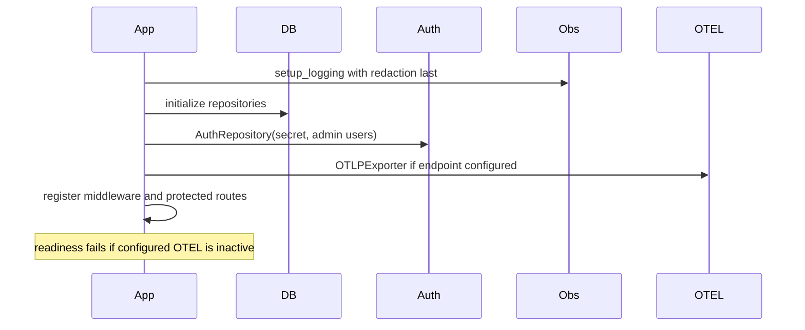
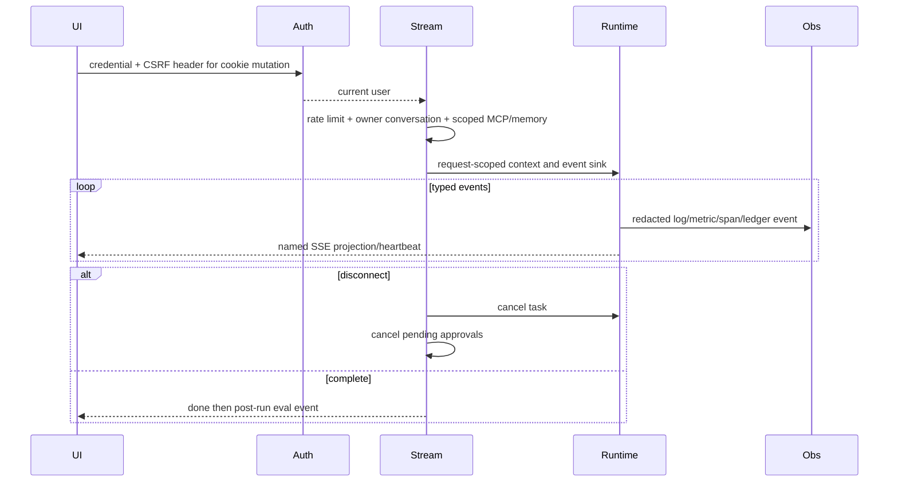
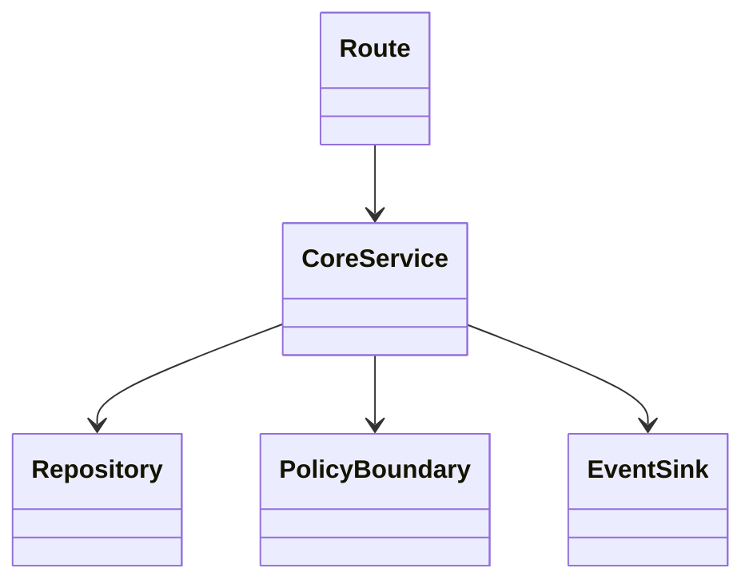
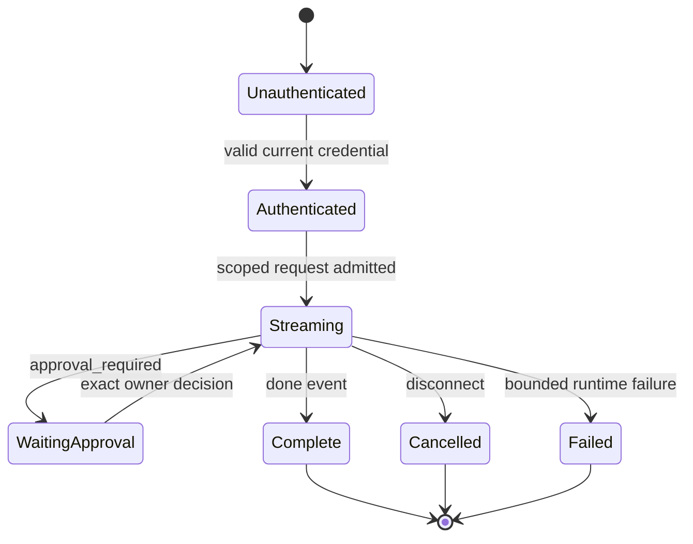

# Module 13 — Authentication, ownership, SSE, UI, and observability

> **Content status:** current
> **Reviewed revision:** `3577b00` documentation review
> **Estimated time:** 120 minutes
> **Canonical concepts:** [authentication](../../concepts/authentication.md), [authorization-ownership](../../concepts/authorization-ownership.md), [sse](../../concepts/sse.md), [structured-logging](../../concepts/structured-logging.md), [metrics](../../concepts/metrics.md), [tracing-opentelemetry](../../concepts/tracing-opentelemetry.md)

## Why this module exists

A reliable agent request must be attributable, scoped, inspectable, and stream progress without leaking authority or secrets. You will follow one authenticated SSE request from UI to runtime and back through durable evidence, structured logs, metrics, and OTLP spans.

## Beginner explanation

A production-oriented agent is more than a model response: it must limit authority, preserve ownership, make failures explicit, and leave evidence that another person can inspect. This module introduces those ideas in plain language before tracing their concrete Archon implementation. The diagrams are maps of verified boundaries, not claims that every dependency is production deployed.

## Prerequisites and vocabulary

### Learn first

- [Module 05: policy and approvals](../05-policy-and-approvals/README.md) — trust and exact authorization.
- [Module 07: Run Ledger](../07-run-ledger/README.md) — durable event evidence and lineage.
- [Module 10: resilience](../10-resilience/README.md) — timeout, cancellation and bounded failure.

### Vocabulary

| Term | Beginner definition | Canonical source |
|---|---|---|
| authentication | Resolving credentials to a current identity. | [authentication](../../concepts/authentication.md) |
| authorization | Deciding whether that identity may act on a resource. | [authentication](../../concepts/authentication.md) |
| SSE | One-way named events over a streaming HTTP response. | [authentication](../../concepts/authentication.md) |
| correlation ID | Request identifier shared by logs and response headers. | [authentication](../../concepts/authentication.md) |
| span | Timed unit of work in a trace. | [authentication](../../concepts/authentication.md) |
| metric | Numeric aggregate over events. | [authentication](../../concepts/authentication.md) |

## Learning outcomes

After this module, the learner can:

1. distinguish authentication, owner scoping, policy authorization, and CSRF;
2. trace streaming cancellation and approval cleanup;
3. correlate one request across SSE, ledger, log, metric, trace, and UI;
4. state privacy/cardinality and local-telemetry limits;

## Problem and mental model

Identity is the root label, owner/project is the data fence, policy is the action gate, and observability is the instrument panel. SSE is only a projection of typed events; the Run Ledger remains durable evidence. Logs describe, metrics aggregate, and traces time the path—none alone proves semantic correctness.

The connection to the course spine is explicit: **Policy → Run → Approval → Tool → Evidence → Evaluation**. Inputs are authenticated/scoped data; outputs are typed results plus inspectable evidence; mutable authority never comes from model prose.

## Architecture and components

```mermaid
flowchart LR
  UI[Svelte Workbench] -->|JWT cookie/Bearer/API key| MW[security + correlation middleware]
  MW --> SSE[chat_stream_real]
  SSE --> RT[typed runtime]
  RT --> L[(Run Ledger)]
  RT --> LOG[redacted structlog + owner buffer]
  RT --> M[/metrics]
  RT --> T[OTLP spans]
  RT --> SSE
  SSE --> UI
```

### Component responsibilities

| Component | Responsibility | Must not be assumed |
|---|---|---|
| API/UI boundary | Validate identity, shape and request scope. | UI visibility is not authorization. |
| Core service/runtime | Enforce typed bounds and coordinate dependencies. | A class existing means every route uses it. |
| Persistence | Store owner-scoped state/evidence atomically where required. | Evidence means semantic truth or tamper-proof WORM audit. |
| Observability | Emit redacted, correlatable signals. | Telemetry is durable delivery or chain-of-thought. |

## Startup sequence



Startup validates deployment-owned settings, constructs dependencies, and fails closed when a required security or persistence dependency is unavailable. Optional capabilities remain visibly disabled rather than silently simulated.

## Per-request sequence



The alternate path is part of the design: denial, stale state, malformed input, timeout, cancellation, or dependency error produces a stable bounded result/evidence rather than invented success.

## Class and dependency view



The implementation favors dependency injection and composition. The arrows show use, not inheritance.

## State and lifecycle



Only source-defined statuses/events are evidence. A transient UI state must not overwrite a durable terminal state.

## Source walkthrough

| Order | Source symbol | Why inspect it | Implementation status/boundary |
|---:|---|---|---|
| 1 | [`backend/app/security/auth.py:get_current_user / AuthRepository`](../../../../backend/app/security/auth.py) | scrypt, JWT/API-key verification and durable user recheck. | `implemented` within stated boundary |
| 2 | [`backend/app/middleware/security.py:CSRFMiddleware.dispatch`](../../../../backend/app/middleware/security.py) | Cookie mutation CSRF boundary and security headers. | `implemented` within stated boundary |
| 3 | [`backend/app/middleware/correlation.py:CorrelationIdMiddleware.dispatch`](../../../../backend/app/middleware/correlation.py) | Context correlation ID and response echo. | `implemented` within stated boundary |
| 4 | [`backend/app/routes/stream.py:chat_stream_real / _sse`](../../../../backend/app/routes/stream.py) | Owner-scoped runtime and cancellation-safe SSE adaptation. | `implemented` within stated boundary |
| 5 | [`backend/app/observability/runtime_events.py:CompositeEventSink.emit`](../../../../backend/app/observability/runtime_events.py) | One typed event to redacted logs, metrics, spans and ledger. | `implemented` within stated boundary |
| 6 | [`backend/app/observability/logging.py:redact_event`](../../../../backend/app/observability/logging.py) | Recursive credential/PII redaction before rendering. | `implemented` within stated boundary |
| 7 | [`backend/app/observability/metrics.py:get_prometheus_text`](../../../../backend/app/observability/metrics.py) | Process-local bounded metric export. | `implemented` within stated boundary |
| 8 | [`backend/app/observability/otel_exporter.py:OTLPExporter`](../../../../backend/app/observability/otel_exporter.py) | Real SDK when installed/configured; explicit fallback state. | `implemented` within stated boundary |

### Tests to inspect

| Test | Contract proved | What it does not prove |
|---|---|---|
| [`backend/tests/integration/test_auth_persistence.py`](../../../../backend/tests/integration/test_auth_persistence.py) | durable users and credentials. | Does not prove public deployment, external-provider parity, or production scale. |
| [`backend/tests/security/test_conversation_ownership.py`](../../../../backend/tests/security/test_conversation_ownership.py) | cross-owner resources are hidden. | Does not prove public deployment, external-provider parity, or production scale. |
| [`backend/tests/unit/test_runtime_sse.py`](../../../../backend/tests/unit/test_runtime_sse.py) | typed event projection and stream behavior. | Does not prove public deployment, external-provider parity, or production scale. |
| [`backend/tests/unit/test_operational_log_privacy.py`](../../../../backend/tests/unit/test_operational_log_privacy.py) | credential/PII log hardening. | Does not prove public deployment, external-provider parity, or production scale. |
| [`backend/tests/unit/test_runtime_observability.py`](../../../../backend/tests/unit/test_runtime_observability.py) | runtime metrics/spans/log events. | Does not prove public deployment, external-provider parity, or production scale. |
| [`backend/tests/unit/test_otel_tracing_wire.py`](../../../../backend/tests/unit/test_otel_tracing_wire.py) | OTLP exporter wiring and readiness. | Does not prove public deployment, external-provider parity, or production scale. |

## Try it: bounded exercise

### Goal

Run the focused contract set and turn each passing test into one precise claim plus one limitation.

### Safety and setup

- Working directory starts at repository root; backend dependencies must be installed with `uv`.
- The focused set uses fixtures/local state. Do not insert real credentials or point fixtures at external services.
- Side effects are test databases/processes cleaned by fixtures; if interrupted, remove only resources you created.

### Steps

```bash
cd backend
uv run pytest -q tests/integration/test_auth_persistence.py tests/security/test_conversation_ownership.py tests/unit/test_runtime_sse.py tests/unit/test_operational_log_privacy.py tests/unit/test_runtime_observability.py tests/unit/test_otel_tracing_wire.py
```

Create a two-column note: **proved invariant** and **not proved**. Include at least one security invariant, one failure path, and one evidence path.

### Done criteria

- [ ] Every focused test passes, or a real environment blocker is recorded without fabricating output.
- [ ] At least three results are tied to exact symbols and assertions.
- [ ] The learner states the local/provider/deployment boundary aloud.
- [ ] Temporary resources are absent or explicitly cleaned.

## Security and failure modes

| Threat or failure | Boundary/control | Failure behavior | Residual risk |
|---|---|---|---|
| Stolen/forged credential | scrypt, HS256 validation, expiry, hashed API keys, durable user lookup | 401 | No external IdP, revocation list, or automated signing-key rotation. |
| Cross-owner resource ID | Owner included in repository lookup | 404/denial | Every new query needs review. |
| Cookie CSRF | Token cookie/header check on mutating cookie-auth requests | 403 | XSS remains relevant; bearer/API key has different threat model. |
| SSE disconnect/slow client | Per-request queue, heartbeat, task cancellation, approval cleanup | Cancelled run path | No durable delivery acknowledgement. |
| Telemetry leakage/cardinality | Recursive redaction, safe hashes, bounded labels | Sanitized metadata | Redaction is not a complete privacy audit. |

Malformed input, dependency failure, timeout/cancellation, concurrency/idempotency, owner scope, secret/PII handling, and resource limits must be reconsidered whenever this path changes.

## Observability and evidence path

```text
correlation ID → authenticated owner/project → typed runtime event → redacted log + durable Run Ledger → metric/OTLP span/UI → evaluation
```

| Evidence | Link or command | Claim supported | Scope/limit |
|---|---|---|---|
| Canonical status | [Implementation evidence](../../../IMPLEMENTATION-EVIDENCE.md) | Separates exists/wired/tested/observed/UI/deployed. | Mutable evidence; inspect revision. |
| Architecture | [Architecture diagrams](../../../ARCHITECTURE-DIAGRAMS.md) | Wider component and trust boundaries. | Diagram is not runtime observation. |
| Focused tests | command above | Deterministic contracts and failure paths. | Fixture/local scope. |

Never expose credentials, raw provider exceptions, tool payloads, personal data, or hidden chain-of-thought as “evidence.”

## Lab vs production

| Dimension | Demonstrated in repository/lab | Required or unverified for production |
|---|---|---|
| Deployment | Local/test paths and artifacts. | Public ingress, multi-host operation, SLO/on-call; public deployment is deferred. |
| Data and scale | Bounded fixtures and local persistent data. | Capacity, retention, sustained load and multi-replica behavior. |
| Providers | Deterministic/mock/local dependencies as explicitly linked. | Final external providers were not verified. |
| Security/operations | Tested ownership, validation, policy and redaction controls. | Independent audit, rotation, production alerting and incident drills. |

Auth and ownership are enforced on tested product paths. OTEL SDK exported agent.run to the local collector. Metrics are process-local, the owner log stream is in-memory, and there is no hosted trace store, production alerting, external IdP, multi-replica aggregation, or public deployment.

## Interview answer

### 30-second answer

> An Archon request authenticates to a current durable user, scopes every repository and MCP lookup by owner/project, and sends side effects through policy/approval. The SSE route projects typed runtime events and cancels runtime plus approvals on disconnect. The same events create redacted structured logs, process-local Prometheus metrics, durable ledger records and OTLP spans linked by run/correlation IDs. A local collector was observed; hosted production telemetry is not claimed.

### Deeper follow-ups

- **Why this design?** It limits authority, makes failure explicit, and produces inspectable evidence.
- **What fails?** Invalid input, unavailable dependencies, timeouts/cancellation, stale bindings, denied policy, and persistence failure each need distinct handling.
- **How do you know?** Point to one exact symbol, one exact test, and one revision-scoped observation.
- **What would production require?** External acceptance, sustained/multi-instance tests, audited controls, hosted operations and explicit SLO/recovery objectives.

## Self-check

1. Authentication versus ownership?
2. Why is SSE not the ledger?
3. What happens on disconnect?
4. Logs, metrics, traces?
5. What did OTEL evidence prove?
6. Why avoid raw errors/payloads?

<details>
<summary>Answer guide</summary>

1. Authentication resolves identity; ownership includes that trusted identity in resource queries.
2. SSE delivery is transient and client-specific; the ledger is durable, ordered run evidence.
3. The runtime task is cancelled and pending approvals for that run are cancelled in finally.
4. Logs carry redacted event fields, metrics aggregate counts/latency, traces connect timed spans.
5. The configured real SDK/exporter emitted agent.run to a local collector; no hosted backend/SLO.
6. Provider/tool messages can contain secrets or PII; safe type/reason/hash metadata preserves utility with less exposure.

</details>

## Further reading

- Canonical concepts: [authentication](../../concepts/authentication.md), [authorization-ownership](../../concepts/authorization-ownership.md), [sse](../../concepts/sse.md), [structured-logging](../../concepts/structured-logging.md), [metrics](../../concepts/metrics.md), [tracing-opentelemetry](../../concepts/tracing-opentelemetry.md)
- [Implementation evidence](../../../IMPLEMENTATION-EVIDENCE.md)
- [Architecture diagrams](../../../ARCHITECTURE-DIAGRAMS.md)
- [Next step](../14-local-operations/README.md)

## Done criteria

You can draw startup, request, state and evidence flows; name exact source/test boundaries; run the exercise safely; explain security and failures; and distinguish implemented local evidence from deferred production claims.
