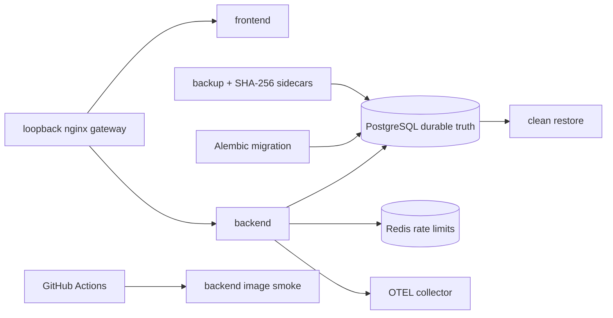
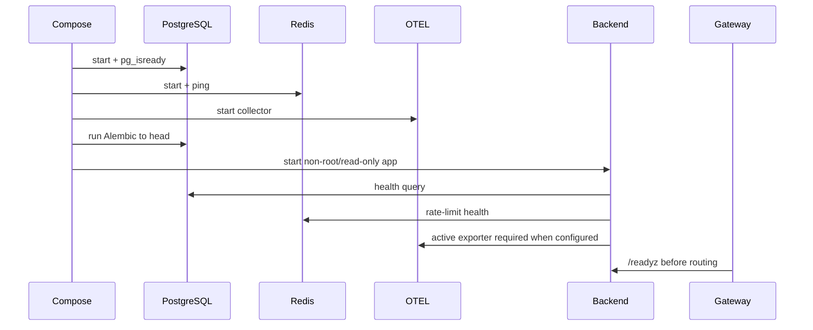
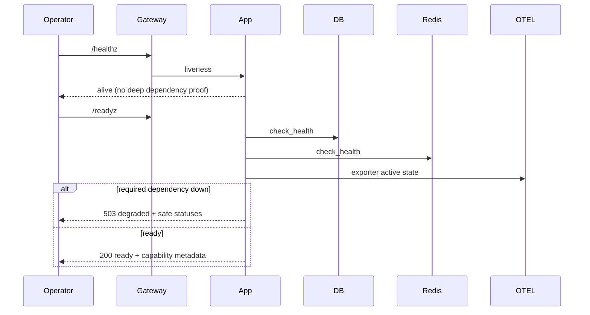
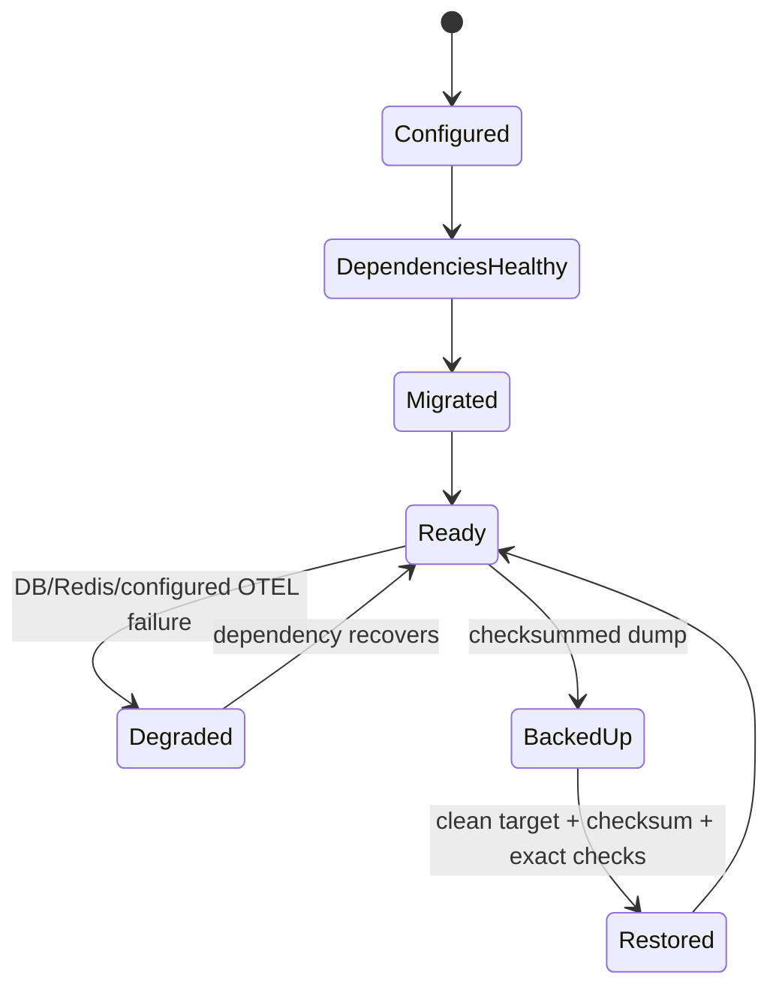

# Module 14 — Local operations: Compose, health, migrations, CI, and recovery

> **Documentation status:** Draft
> **Estimated time:** 150 minutes
> **Canonical concepts:** [liveness-readiness](../../concepts/liveness-readiness.md), [docker-compose](../../concepts/docker-compose.md), [migrations](../../concepts/migrations.md), [ci](../../concepts/ci.md), [backup-restore](../../concepts/backup-restore.md), [rto-rpo](../../concepts/rto-rpo.md)

## Why this module exists

Code is not operable until it starts reproducibly, reports dependency health, migrates durable state, passes clean-room checks, and can recover from loss. You will inspect the local Compose target and produce or analyze a checksummed clean-restore report without calling it production deployment.

## Beginner explanation

Operations asks whether a specific build can start, become ready, preserve schema, pass clean-worker gates, and recover durable state. Compose files and scripts are recipes; only revision- and environment-scoped executions are observations.

## Prerequisites and vocabulary

### Learn first

- [Module 09: evaluation](../09-evaluation-harness/README.md) — evidence and regression semantics.
- [Module 10: resilience](../10-resilience/README.md) — timeout, cancellation and bounded failure.
- [Module 13: auth and observability](../13-auth-ui-observability/README.md) — readiness and inspectability dependencies.

### Vocabulary

| Term | Beginner definition | Canonical source |
|---|---|---|
| liveness | Whether the process should be restarted. | [liveness-readiness](../../concepts/liveness-readiness.md) |
| readiness | Whether required dependencies permit traffic. | [liveness-readiness](../../concepts/liveness-readiness.md) |
| migration | Versioned durable schema transition. | [migrations](../../concepts/migrations.md) |
| backup | Protected recoverable copy of authoritative data. | [backup and restore](../../concepts/backup-restore.md) |
| RTO/RPO | Objectives, distinct from observed recovery values. | [RTO and RPO](../../concepts/rto-rpo.md) |
| CI | Automated clean-worker quality gates. | [CI](../../concepts/ci.md) |

## Learning outcomes

After this module, the learner can:

1. explain Compose dependency and hardening boundaries;
2. distinguish health, readiness, and end-to-end smoke;
3. trace Alembic migration before app readiness;
4. execute focused operations tests and read the DR report;
5. report CI and measured recovery observations with revision/environment limits, without calling them RTO/RPO objectives;

## Problem and mental model

Operations is a chain of evidence: configuration → start → migrate → ready → serve → observe → back up → destroy → restore → verify exact records. A manifest is a recipe, not proof the meal was cooked. A backup is unproven until restored.

The connection to the course spine is explicit: **Policy → Run → Approval → Tool → Evidence → Evaluation**. Inputs are authenticated/scoped data; outputs are typed results plus inspectable evidence; mutable authority never comes from model prose.

## Architecture and components



### Component responsibilities

| Component | Responsibility | Must not be assumed |
|---|---|---|
| Compose target | Order internal services, migration and loopback ingress. | A manifest proves a deployment ran. |
| Health endpoints | Separate shallow liveness from dependency readiness. | Readiness is an end-to-end SLO. |
| CI workflow | Run declared checks on a clean revision. | Green CI proves deployment or later HEAD. |
| DR scripts | Dump, checksum, clean-restore and compare PostgreSQL state. | One drill defines business objectives. |

## Startup sequence



Compose waits for PostgreSQL/Redis/collector health, runs Alembic to head, then starts the backend and gateway. Migration or required dependency failure prevents readiness; it is not converted to a simulated healthy mode.

## Per-request sequence



These probes are ordinary operational HTTP endpoints, not authenticated Run Ledger jobs. Dependency failure produces a safe degraded response; CI and recovery remain separate workflows and evidence artifacts.

## Operational boundaries

There is no useful application class diagram for CI, Compose, or disaster recovery. These are workflow and infrastructure boundaries: CI executes repository gates; Compose orders services; Alembic owns schema transition; backup/restore scripts operate directly on PostgreSQL and produce files/reports outside the authenticated agent request API.

## State and lifecycle



This is an operational dependency model, not an application entity state machine. Readiness responses, migration exits, checksums and restore reports provide different evidence and must retain their own scope.

## Source walkthrough

| Order | Source symbol | Why inspect it | Implementation status/boundary |
|---:|---|---|---|
| 1 | [`docker-compose.local.yml:services`](../../../../docker-compose.local.yml) | Digest pins, loopback gateway, health ordering and persistent volumes. | `implemented` within stated boundary |
| 2 | [`backend/app/main.py:lifespan / healthz / readyz`](../../../../backend/app/main.py) | Startup validation and dependency-aware readiness. | `implemented` within stated boundary |
| 3 | [`backend/alembic/versions/20260826_08_mcp_inventory.py:upgrade`](../../../../backend/alembic/versions/20260826_08_mcp_inventory.py) | Latest observed schema revision content. | `implemented` within stated boundary |
| 4 | [`.github/workflows/ci.yml:backend-quality / frontend-quality / backend-image`](../../../../.github/workflows/ci.yml) | Clean-worker gates and image smoke. | `implemented` within stated boundary |
| 5 | [`scripts/local-deploy-smoke.sh:local deployment smoke`](../../../../scripts/local-deploy-smoke.sh) | Auth, metrics, migration and OTEL local checks. | `implemented` within stated boundary |
| 6 | [`scripts/local-backup.sh:backup flow`](../../../../scripts/local-backup.sh) | Secure env, custom dump, atomic move, checksum/metadata. | `implemented` within stated boundary |
| 7 | [`scripts/local-restore.sh:restore flow`](../../../../scripts/local-restore.sh) | Checksum and clean-target guard. | `implemented` within stated boundary |
| 8 | [`scripts/local-dr-smoke.sh:end-to-end DR drill`](../../../../scripts/local-dr-smoke.sh) | Destroy, restore, authenticate, exact evidence and timings. | `implemented` within stated boundary |

### Tests to inspect

| Test | Contract proved | What it does not prove |
|---|---|---|
| [`backend/tests/unit/test_health.py`](../../../../backend/tests/unit/test_health.py) | liveness/readiness dependency semantics. | Does not prove public deployment, external-provider parity, or production scale. |
| [`backend/tests/unit/test_local_deployment.py`](../../../../backend/tests/unit/test_local_deployment.py) | Compose and smoke-script security contracts. | Does not prove public deployment, external-provider parity, or production scale. |
| [`backend/tests/integration/test_mcp_inventory_migration.py`](../../../../backend/tests/integration/test_mcp_inventory_migration.py) | real migration schema contract. | Does not prove public deployment, external-provider parity, or production scale. |
| [`backend/tests/unit/test_verify_script.py`](../../../../backend/tests/unit/test_verify_script.py) | verification orchestration. | Does not prove public deployment, external-provider parity, or production scale. |
| [`backend/tests/unit/test_local_dr.py`](../../../../backend/tests/unit/test_local_dr.py) | backup/restore guard and report contracts. | Does not prove public deployment, external-provider parity, or production scale. |

## Try it: bounded exercise

### Goal

Run the focused contract set and turn each passing test into one precise claim plus one limitation.

### Safety and setup

- Working directory starts at repository root; backend dependencies must be installed with `uv`.
- The focused set uses fixtures/local state. Do not insert real credentials or point fixtures at external services.
- Side effects are test databases/processes cleaned by fixtures; if interrupted, remove only resources you created.

### Steps

```bash
cd backend
uv run pytest -q tests/unit/test_health.py tests/unit/test_local_deployment.py tests/unit/test_local_dr.py tests/integration/test_mcp_inventory_migration.py
cd ..
python3 -m json.tool docs/evidence/local-dr-report.json >/dev/null
```

Create a two-column note: **proved invariant** and **not proved**. Include at least one security invariant, one failure path, and one evidence path.

### Done criteria

- [ ] Every focused test passes, or a real environment blocker is recorded without fabricating output.
- [ ] At least three results are tied to exact symbols and assertions.
- [ ] The learner states the local/provider/deployment boundary aloud.
- [ ] Temporary resources are absent or explicitly cleaned.

## Security and failure modes

| Threat or failure | Boundary/control | Failure behavior | Residual risk |
|---|---|---|---|
| World-readable secrets/backup | Mode-0600 env/dump checks; never print env | Script refuses | Host security and off-site encryption remain operator work. |
| Wrong/corrupt dump | SHA-256 sidecar and metadata | Restore refuses mismatch | Checksum is not an authenticity signature. |
| Overwrite live target | Non-empty target guard | Refuse unless explicit ALLOW_REPLACE=1 | Override is intentionally destructive. |
| Schema drift | Alembic revision + migration tests | Startup/smoke fails | Zero-downtime downgrade compatibility unverified. |
| False deployment claim | Loopback bind and evidence dimensions | Deployed remains No | Historical cloud manifests can mislead readers. |

Also review interrupted dumps, disk exhaustion, key continuity, partial migrations, stale images, destructive overrides and restore verification whenever this path changes.

## Observability and evidence path

```text
correlation ID → authenticated owner/project → typed runtime event → redacted log + durable Run Ledger → metric/OTLP span/UI → evaluation
```

| Evidence | Link or command | Claim supported | Scope/limit |
|---|---|---|---|
| Canonical status | [Implementation evidence](../../../IMPLEMENTATION-EVIDENCE.md) | Separates exists/wired/tested/observed/UI/deployed. | Mutable evidence; inspect revision. |
| Architecture | [Architecture diagrams](../../../ARCHITECTURE-DIAGRAMS.md) | Wider component and trust boundaries. | Diagram is not runtime observation. |
| Focused tests | command above | Deterministic contracts and failure paths. | Fixture/local scope. |

Never expose credentials, raw provider exceptions, tool payloads, personal data, or hidden chain-of-thought as “evidence.”

## Lab vs production

| Dimension | Demonstrated in repository/lab | Required or unverified for production |
|---|---|---|
| Deployment | Local/test paths and artifacts. | Public ingress, multi-host operation, SLO/on-call; public deployment is deferred. |
| Data and scale | Bounded fixtures and local persistent data. | Capacity, retention, sustained load and multi-replica behavior. |
| Providers | Deterministic/mock/local dependencies as explicitly linked. | Final external providers were not verified. |
| Security/operations | Tested ownership, validation, policy and redaction controls. | Independent audit, rotation, production alerting and incident drills. |

The local stack and DR drill have revision-scoped observations. Their recovery values are measurements, not objectives. Exact CI run/revision and DR environment values live only in [implementation evidence](../../../IMPLEMENTATION-EVIDENCE.md). Public deployment, scheduled/off-site backups, PITR, multi-region failover and production objectives remain deferred.

## Interview answer

### 30-second answer

> Archon has a reproducible local Compose target with loopback-only ingress, migrations and dependency-aware readiness. Recovery uses a private PostgreSQL custom dump, checksum/metadata, clean-target guard and exact checks. The canonical evidence page records one drill's recovery observations and one revision's CI result; neither is an objective, SLO, or public deployment claim.

### Deeper follow-ups

- **Why separate liveness/readiness?** Dependency outages should remove traffic without forcing restart loops.
- **Why restore to a clean target?** It avoids concealing missing data behind pre-existing rows.
- **Observation versus objective?** A timed drill reports what happened; an objective is an agreed target tested repeatedly.
- **What remains?** Scheduled off-site encrypted backups, PITR, representative drills, alerting/on-call and public deployment.

## Self-check

1. Why doesn’t /healthz query every dependency?
2. Why is Redis absent from the durable backup?
3. What makes the backup procedure safer?
4. Observed RTO versus objective?
5. What does green CI prove?
6. Why is local Compose not production?

<details>
<summary>Answer guide</summary>

1. Liveness should avoid restart loops caused by downstream failures; readiness handles traffic eligibility.
2. It stores live rate-limit state, while PostgreSQL is authoritative durable evidence.
3. Secure env mode, no overwrite, custom dump, atomic move, 0600 output, checksum and metadata.
4. The canonical report's elapsed time is one local measured result; an objective is an agreed target backed by repeated production-like drills.
5. Specified gates passed on a clean GitHub worker at exact run/revision, not deployment or later HEAD.
6. Loopback single-host operation lacks public ingress, scaling, SLO/on-call, managed recovery and external-provider evidence.

</details>

## Further reading

- Canonical concepts: [liveness-readiness](../../concepts/liveness-readiness.md), [docker-compose](../../concepts/docker-compose.md), [migrations](../../concepts/migrations.md), [ci](../../concepts/ci.md), [backup-restore](../../concepts/backup-restore.md), [rto-rpo](../../concepts/rto-rpo.md)
- [Implementation evidence](../../../IMPLEMENTATION-EVIDENCE.md)
- [Architecture diagrams](../../../ARCHITECTURE-DIAGRAMS.md)
- [Next step](../15-capstone/README.md)

## Done criteria

You can draw startup, request, state and evidence flows; name exact source/test boundaries; run the exercise safely; explain security and failures; and distinguish implemented local evidence from deferred production claims.
