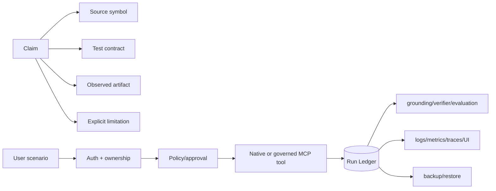
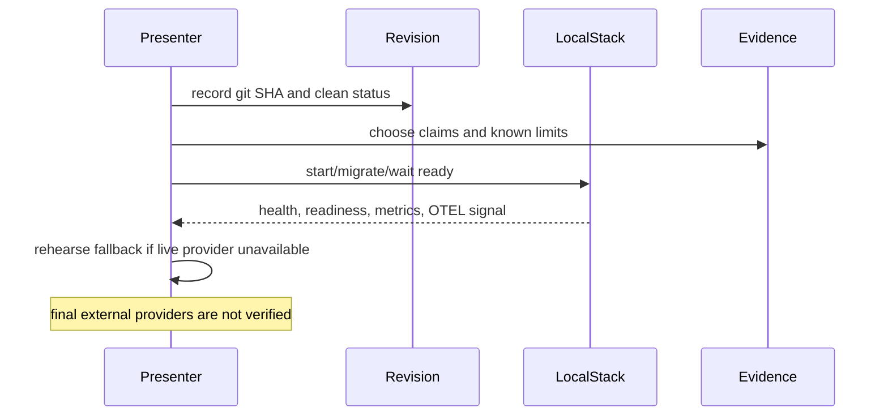
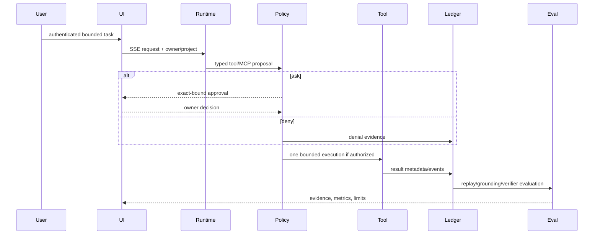
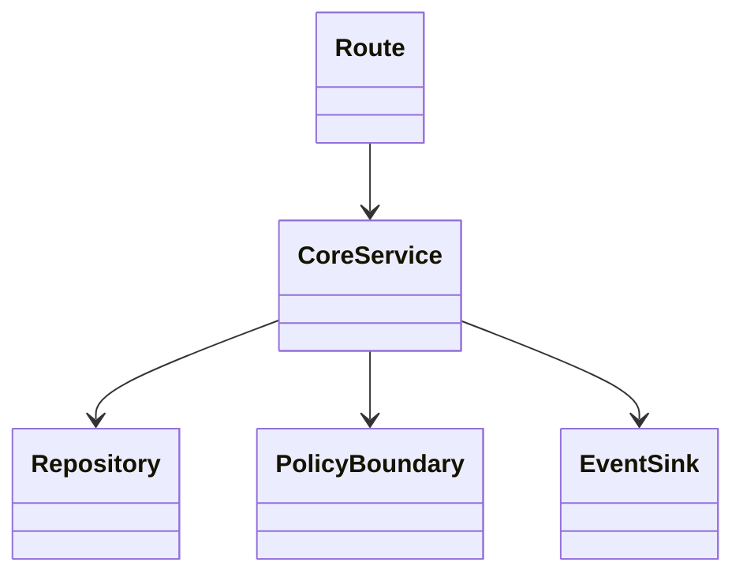
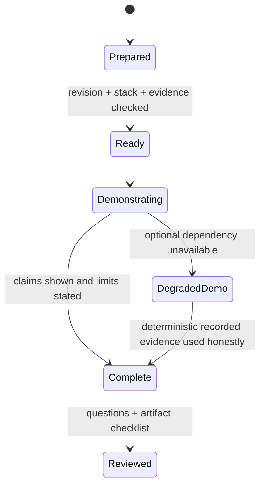

# Module 15 — Capstone: evidence-first demo and interview defense

> **Content status:** current
> **Reviewed revision:** `3577b00` documentation review
> **Estimated time:** 180 minutes
> **Canonical concepts:** [bounded-delegation](../../concepts/bounded-delegation.md), [mcp](../../concepts/mcp.md), [authentication](../../concepts/authentication.md), [tracing-opentelemetry](../../concepts/tracing-opentelemetry.md), [backup-restore](../../concepts/backup-restore.md), [rto-rpo](../../concepts/rto-rpo.md)

## Why this module exists

The capstone is not another feature. It is a disciplined claim-to-evidence narrative that joins policy, approvals, ledger, RAG/evaluation, one verifier child, MCP, observability, and local recovery. You will prepare truthful 2-, 15-, and 45-minute walkthroughs and an evidence packet.

## Beginner explanation

A production-oriented agent is more than a model response: it must limit authority, preserve ownership, make failures explicit, and leave evidence that another person can inspect. This module introduces those ideas in plain language before tracing their concrete Archon implementation. The diagrams are maps of verified boundaries, not claims that every dependency is production deployed.

## Prerequisites and vocabulary

### Learn first

- [Module 05: policy and approvals](../05-policy-and-approvals/README.md) — trust and exact authorization.
- [Module 07: Run Ledger](../07-run-ledger/README.md) — durable event evidence and lineage.
- [Module 10: resilience](../10-resilience/README.md) — timeout, cancellation and bounded failure.

### Vocabulary

| Term | Beginner definition | Canonical source |
|---|---|---|
| claim ladder | Exists, wired, tested, observed, UI, deployed assessed independently. | [bounded-delegation](../../concepts/bounded-delegation.md) |
| demo invariant | A behavior stated so an observer can tell pass from fail. | [bounded-delegation](../../concepts/bounded-delegation.md) |
| evidence packet | Revision, command, environment, artifacts, limits, and source/test links. | [bounded-delegation](../../concepts/bounded-delegation.md) |
| deferred | Intentionally not claimed or delivered in current scope. | [bounded-delegation](../../concepts/bounded-delegation.md) |

## Learning outcomes

After this module, the learner can:

1. select claims supported by direct evidence;
2. run a focused cross-capability acceptance;
3. deliver layered demos without hiding limits;
4. answer design/failure/security/operations follow-ups with exact symbols;
5. identify production gaps rather than hand-wave them;

## Problem and mental model

Build the story as a proof graph. Every claim points to source, test, observed artifact, and limitation. The graph may stop at local observation; never draw an unsupported edge to production. The demo spine is Policy → Run → Approval → Tool → Evidence → Evaluation, with auth/ownership around it and operations beneath it.

The connection to the course spine is explicit: **Policy → Run → Approval → Tool → Evidence → Evaluation**. Inputs are authenticated/scoped data; outputs are typed results plus inspectable evidence; mutable authority never comes from model prose.

## Architecture and components



### Component responsibilities

| Component | Responsibility | Must not be assumed |
|---|---|---|
| API/UI boundary | Validate identity, shape and request scope. | UI visibility is not authorization. |
| Core service/runtime | Enforce typed bounds and coordinate dependencies. | A class existing means every route uses it. |
| Persistence | Store owner-scoped state/evidence atomically where required. | Evidence means semantic truth or tamper-proof WORM audit. |
| Observability | Emit redacted, correlatable signals. | Telemetry is durable delivery or chain-of-thought. |

## Startup sequence



Startup validates deployment-owned settings, constructs dependencies, and fails closed when a required security or persistence dependency is unavailable. Optional capabilities remain visibly disabled rather than silently simulated.

## Per-request sequence



The alternate path is part of the design: denial, stale state, malformed input, timeout, cancellation, or dependency error produces a stable bounded result/evidence rather than invented success.

## Class and dependency view



The implementation favors dependency injection and composition. The arrows show use, not inheritance.

## State and lifecycle



Only source-defined statuses/events are evidence. A transient UI state must not overwrite a durable terminal state.

## Source walkthrough

| Order | Source symbol | Why inspect it | Implementation status/boundary |
|---:|---|---|---|
| 1 | [`docs/IMPLEMENTATION-EVIDENCE.md:capability matrix`](../../../../docs/IMPLEMENTATION-EVIDENCE.md) | Canonical mutable claim/evidence boundaries. | `implemented` within stated boundary |
| 2 | [`backend/app/runtime/engine.py:AgentRuntime.run`](../../../../backend/app/runtime/engine.py) | Bounded runtime spine. | `implemented` within stated boundary |
| 3 | [`backend/app/security/policy.py:PolicyEngine.evaluate`](../../../../backend/app/security/policy.py) | Deterministic tool decision boundary. | `implemented` within stated boundary |
| 4 | [`backend/app/services/run_ledger.py:RunRepository`](../../../../backend/app/services/run_ledger.py) | Durable event/evidence spine. | `implemented` within stated boundary |
| 5 | [`backend/app/delegation/service.py:EvidenceVerifierSpecialist`](../../../../backend/app/delegation/service.py) | One evidence-only child. | `implemented` within stated boundary |
| 6 | [`backend/app/mcp/runtime.py:MCPRuntimeToolProvider`](../../../../backend/app/mcp/runtime.py) | Governed external tool binding. | `implemented` within stated boundary |
| 7 | [`backend/app/observability/runtime_events.py:CompositeEventSink`](../../../../backend/app/observability/runtime_events.py) | Cross-signal observability. | `implemented` within stated boundary |
| 8 | [`scripts/local-dr-smoke.sh:local DR proof`](../../../../scripts/local-dr-smoke.sh) | Recovery and exact evidence comparison. | `implemented` within stated boundary |

### Tests to inspect

| Test | Contract proved | What it does not prove |
|---|---|---|
| [`backend/tests/integration/test_live_policy_wiring.py`](../../../../backend/tests/integration/test_live_policy_wiring.py) | live policy/approval path. | Does not prove public deployment, external-provider parity, or production scale. |
| [`backend/tests/integration/test_run_replay_api.py`](../../../../backend/tests/integration/test_run_replay_api.py) | durable replay evidence. | Does not prove public deployment, external-provider parity, or production scale. |
| [`backend/tests/integration/test_verifier_benefit.py`](../../../../backend/tests/integration/test_verifier_benefit.py) | bounded verifier measurement. | Does not prove public deployment, external-provider parity, or production scale. |
| [`backend/tests/integration/test_mcp_runtime.py`](../../../../backend/tests/integration/test_mcp_runtime.py) | governed MCP invocation. | Does not prove public deployment, external-provider parity, or production scale. |
| [`backend/tests/unit/test_otel_tracing_wire.py`](../../../../backend/tests/unit/test_otel_tracing_wire.py) | trace wiring. | Does not prove public deployment, external-provider parity, or production scale. |
| [`backend/tests/unit/test_local_dr.py`](../../../../backend/tests/unit/test_local_dr.py) | recovery contracts. | Does not prove public deployment, external-provider parity, or production scale. |

## Try it: bounded exercise

### Goal

Run the focused contract set and turn each passing test into one precise claim plus one limitation.

### Safety and setup

- Working directory starts at repository root; backend dependencies must be installed with `uv`.
- The focused set uses fixtures/local state. Do not insert real credentials or point fixtures at external services.
- Side effects are test databases/processes cleaned by fixtures; if interrupted, remove only resources you created.

### Steps

```bash
cd backend
uv run pytest -q tests/integration/test_live_policy_wiring.py tests/integration/test_run_replay_api.py tests/integration/test_verifier_benefit.py tests/integration/test_mcp_runtime.py tests/unit/test_otel_tracing_wire.py tests/unit/test_local_dr.py
```

Create a two-column note: **proved invariant** and **not proved**. Include at least one security invariant, one failure path, and one evidence path.

### Done criteria

- [ ] Every focused test passes, or a real environment blocker is recorded without fabricating output.
- [ ] At least three results are tied to exact symbols and assertions.
- [ ] The learner states the local/provider/deployment boundary aloud.
- [ ] Temporary resources are absent or explicitly cleaned.

## Security and failure modes

| Threat or failure | Boundary/control | Failure behavior | Residual risk |
|---|---|---|---|
| Demo overclaim | Claim ladder + exact revision/environment | State “not verified” instead of extrapolating | Audience may still conflate local and production. |
| Secret or personal data on screen | Synthetic account/data; redacted logs; preflight | Abort/clear if sensitive data appears | Screen recording is another data sink. |
| Live provider outage | Deterministic tests and recorded local artifacts | Switch to clearly labeled evidence path | No fabrication of live output. |
| Destructive tool/restore | Use fixtures, exact approval, isolated clean target | Policy denial/guard refusal | Operator error remains possible. |
| Stale evidence | Record SHA, run ID, command, timestamp/environment | Do not apply evidence to a different revision | Docs and runtime may drift. |

Malformed input, dependency failure, timeout/cancellation, concurrency/idempotency, owner scope, secret/PII handling, and resource limits must be reconsidered whenever this path changes.

## Observability and evidence path

```text
correlation ID → authenticated owner/project → typed runtime event → redacted log + durable Run Ledger → metric/OTLP span/UI → evaluation
```

| Evidence | Link or command | Claim supported | Scope/limit |
|---|---|---|---|
| Canonical status | [Implementation evidence](../../../IMPLEMENTATION-EVIDENCE.md) | Separates exists/wired/tested/observed/UI/deployed. | Mutable evidence; inspect revision. |
| Architecture | [Architecture diagrams](../../../ARCHITECTURE-DIAGRAMS.md) | Wider component and trust boundaries. | Diagram is not runtime observation. |
| Focused tests | command above | Deterministic contracts and failure paths. | Fixture/local scope. |

Never expose credentials, raw provider exceptions, tool payloads, personal data, or hidden chain-of-thought as “evidence.”

## Lab vs production

| Dimension | Demonstrated in repository/lab | Required or unverified for production |
|---|---|---|
| Deployment | Local/test paths and artifacts. | Public ingress, multi-host operation, SLO/on-call; public deployment is deferred. |
| Data and scale | Bounded fixtures and local persistent data. | Capacity, retention, sustained load and multi-replica behavior. |
| Providers | Deterministic/mock/local dependencies as explicitly linked. | Final external providers were not verified. |
| Security/operations | Tested ownership, validation, policy and redaction controls. | Independent audit, rotation, production alerting and incident drills. |

The defensible product is an evidence-rich local Agent Reliability Workbench. Remote CI was green at run 33042890654 on 6e3e13f; local OTEL and DR were observed; MCP stdio was verified. Public deployment is deferred and all Deployed values remain No. Final external-provider behavior, provider quality, production traffic, indexed vector serving and SLOs are unverified.

## Interview answer

### 30-second answer

> I frame Archon as an evidence-first local reliability workbench, not a deployed platform. The typed runtime sends every tool—including allowlisted MCP stdio tools—through deterministic policy and exact approvals, persists owner-scoped run evidence, evaluates grounded outputs, and optionally invokes one no-tools verifier child. Auth, SSE, redacted logs, process metrics and OTLP spans make a request inspectable. Compose and a clean restore drill prove local operability. I show source, test, observed artifact and limitation for every claim.

### Deeper follow-ups

- **Why this design?** It limits authority, makes failure explicit, and produces inspectable evidence.
- **What fails?** Invalid input, unavailable dependencies, timeouts/cancellation, stale bindings, denied policy, and persistence failure each need distinct handling.
- **How do you know?** Point to one exact symbol, one exact test, and one revision-scoped observation.
- **What would production require?** External acceptance, sustained/multi-instance tests, audited controls, hosted operations and explicit SLO/recovery objectives.

## Self-check

1. What is your strongest architecture claim?
2. What is deliberately not implemented?
3. How do you recover if a live demo fails?
4. How do you prove ownership?
5. Which observation is local only?
6. What production work comes next?

<details>
<summary>Answer guide</summary>

1. Policy/approval and durable evidence are on the live typed runtime path for native and governed MCP tools.
2. Dynamic swarms/generic reflection, public deployment, MCP HTTP/OAuth, production SLOs and indexed production vector serving.
3. Use deterministic focused tests or recorded artifacts, label them accurately, and never invent provider output.
4. Authenticated user IDs are bound into repository/resource lookups; cross-owner tests expect scoped misses.
5. OTEL collector span, Compose smoke, DR timings, benchmark and MCP stdio fixture observations.
6. Threat-model/audit, external-provider acceptance, hosted telemetry/alerts, multi-instance tests, backup schedule/off-site/PITR, public deployment and SLO drills.

</details>

## Further reading

- Canonical concepts: [bounded-delegation](../../concepts/bounded-delegation.md), [mcp](../../concepts/mcp.md), [authentication](../../concepts/authentication.md), [tracing-opentelemetry](../../concepts/tracing-opentelemetry.md), [backup-restore](../../concepts/backup-restore.md), [rto-rpo](../../concepts/rto-rpo.md)
- [Implementation evidence](../../../IMPLEMENTATION-EVIDENCE.md)
- [Architecture diagrams](../../../ARCHITECTURE-DIAGRAMS.md)
- [Next step](../../README.md)

## Done criteria

You can draw startup, request, state and evidence flows; name exact source/test boundaries; run the exercise safely; explain security and failures; and distinguish implemented local evidence from deferred production claims.
