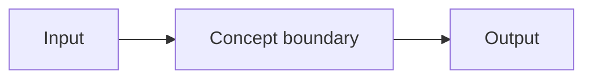
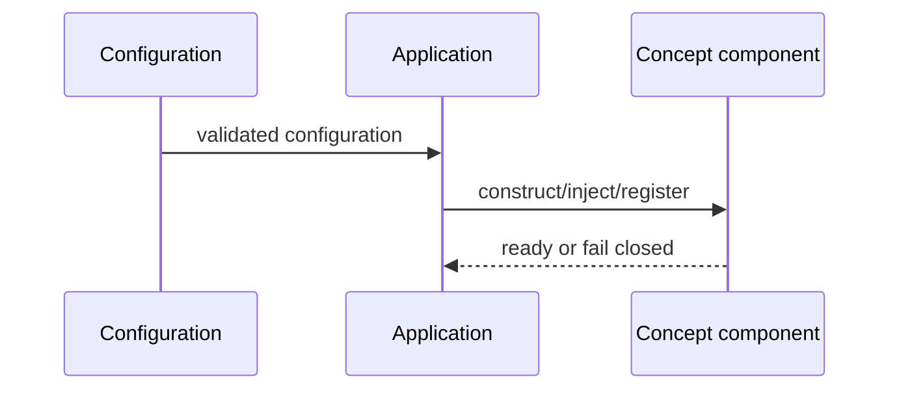
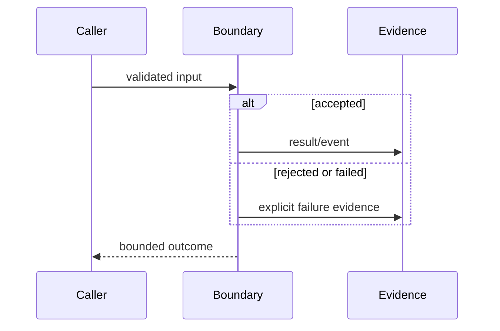
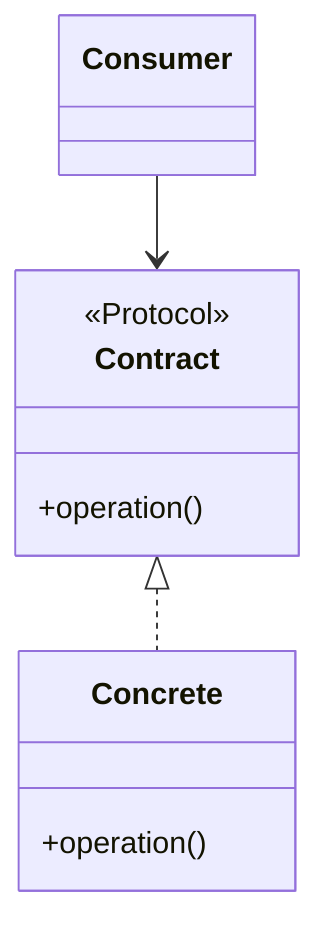
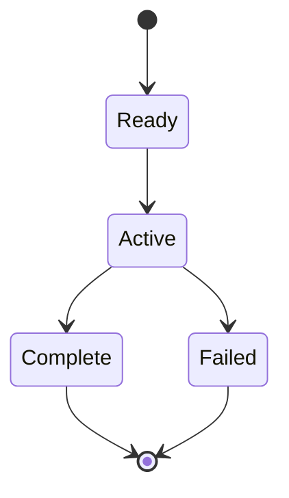

# Concept: Name

> **Implementation status:** `implemented | partial | not-implemented | deferred`
>
> **Status boundary:** `<one precise sentence>`
>
> **Reviewed revision:** `<git revision or not-yet-reviewed>`
>
> **Used by modules:** `<links>`
>
> **Catalog ID:** `<stable-kebab-case-id>`

This page is the single canonical explanation of the concept. Modules, tracks, workshops, and walkthroughs must link here rather than restate it. Remove prompts before review, but retain every top-level section. If a diagram type does not apply, keep its heading and explain why.

## Beginner explanation

Explain the concept in plain English before using Archon-specific names. Give one concrete example and state what the concept is not.

## Prerequisites and vocabulary

### Learn first

- [Prerequisite concept](<relative-link>) — `<why>`

### Vocabulary

| Term | Plain-English meaning | Related concept |
|---|---|---|
| `<term>` | `<definition>` | [Concept](<relative-link>) |

## Problem and mental model

Describe the problem, the mental model, where the analogy breaks, inputs/outputs/state, and important invariants. Distinguish this concept from commonly conflated terms.

## Architecture and components

Show where the concept belongs and its trust/data boundaries. Link rather than copy a broader authoritative architecture diagram.



| Component | Role in this concept | Out of scope |
|---|---|---|
| `<name>` | `<responsibility>` | `<non-goal>` |

## Startup sequence

Explain when the concept is configured, constructed, injected, registered, migrated, or made ready. If it has no startup behavior, say so explicitly.



## Per-request sequence

Show how a request encounters the concept, including a failure or bypass-prevention path. If it runs only after a request, label that explicitly.



## Class and dependency view

Show interfaces/Protocols, implementations, composition, and dependency direction when applicable. Otherwise explain why this concept is data-only or procedural.



## State and lifecycle

Identify states, transitions, terminal outcomes, persistence, and cleanup. Use exact typed names from source where available.



## Archon implementation and source walkthrough

Explain how Archon applies the general concept and why the selected catalog status is honest. Do not turn a historical, mock, fixture, manifest, class, or route into a live claim.

### Source symbols

| Source symbol | Role | Status boundary |
|---|---|---|
| [`module.path:Symbol`](<source-link>) | `<contract/behavior>` | `<wired scope or missing piece>` |

### Tests

| Test | Contract proved | Not proved |
|---|---|---|
| [`test_file.py::test_name`](<test-link>) | `<behavior>` | `<live/provider/load/production boundary>` |

### Runtime evidence

| Evidence | Claim supported | Revision/environment/limit |
|---|---|---|
| [Canonical evidence entry](<evidence-link>) | `<exact dimension>` | `<scope>` |
| [`runtime artifact`](<artifact-link>) | `<observed behavior>` | `<scope>` |

## Try it: command or bounded exercise

### Goal

`<one observable goal>`

### Setup and safety

State working directory, prerequisites, side effects, secret/data restrictions, and cleanup.

### Steps

```bash
<executable command>
```

A bounded diagram, trace, or code-reading exercise is acceptable when execution would be misleading or unsafe.

### Done criteria

- [ ] `<observable result>`
- [ ] `<result tied to symbol/test/evidence>`
- [ ] `<cleanup or no-side-effect confirmation>`

## Security and failure modes

| Threat/failure | Control or boundary | Failure behavior | Residual risk |
|---|---|---|---|
| `<case>` | `<control>` | `<observable outcome>` | `<remaining gap>` |

Cover malformed input, dependency failure, timeout/cancellation, concurrency/idempotency, authorization/ownership, PII/secrets, and resource limits when relevant.

## Observability and evidence path

Describe the path from action to inspectable event, persistence, log/metric/trace/UI, and evaluation. Do not expose hidden chain-of-thought or sensitive payloads.

```text
input → decision/state transition → redacted event → durable evidence → inspection/evaluation
```

For any observation, record revision, environment, and command. Link the mutable evidence matrix instead of copying its status tables or test counts.

## Alternatives and trade-offs

| Alternative | Benefit | Cost/risk | Why selected or deferred |
|---|---|---|---|
| `<alternative>` | `<benefit>` | `<trade-off>` | `<decision>` |

## Lab vs production

| Dimension | Demonstrated | Unverified, partial, or deferred |
|---|---|---|
| Wiring | `<current path>` | `<missing path/parity>` |
| Testing/observation | `<unit/integration/local evidence>` | `<external/scale/traffic gap>` |
| Security | `<control>` | `<trusted boundary/audit gap>` |
| Operations | `<local support>` | `<deployment/SLO/recovery gap>` |

Restate the concept implementation status and its limiting boundary. Local Compose is not public deployment; JSON cosine is not pgvector; one verifier child is not a swarm; ReAct or tool-error feedback is not generic self-reflection.

## Interview answer

### 30-second answer

> `<definition → Archon use → evidence → limitation>`

### Follow-up prompts

- Why is it needed?
- Where is its boundary in code?
- Which test proves its key contract?
- What failure is most important?
- What evidence exists, and what remains unverified for production?

## Self-check

1. `<define the concept without jargon>`
2. `<distinguish it from a nearby concept>`
3. `<trace startup or request behavior>`
4. `<name source symbol, test, and evidence>`
5. `<explain a security/failure mode>`
6. `<state status and lab-vs-production limit>`

<details>
<summary>Answer guide</summary>

1. `<answer>`
2. `<answer>`
3. `<answer>`
4. `<answer>`
5. `<answer>`
6. `<answer>`

</details>

## Related concepts and modules

- **Prerequisites:** `<links>`
- **Builds toward:** `<links>`
- **Modules:** `<links>`
- **Code walkthroughs:** `<links>`
- **Architecture/evidence:** `<links>`

## Luis study note (optional)

> Add only a short mnemonic or interview reminder. Keep the canonical technical explanation in English and above this optional note.
