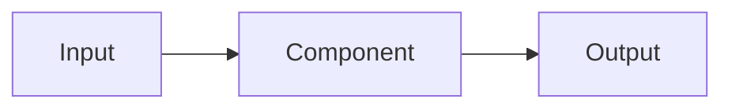
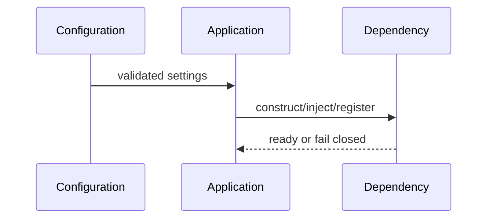
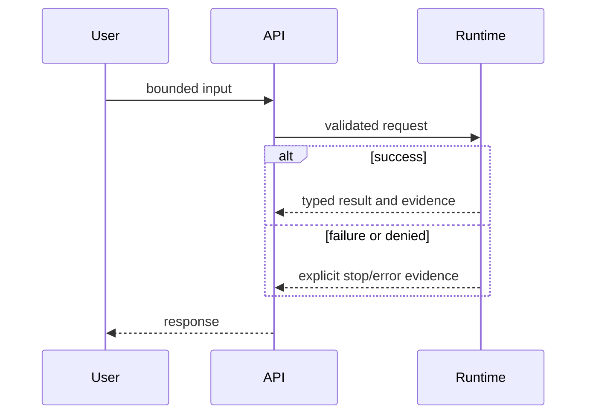
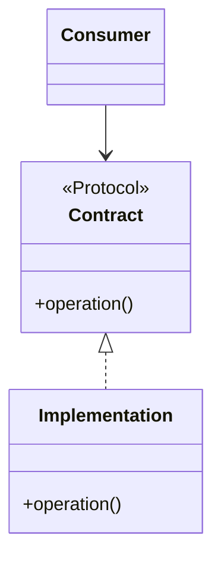
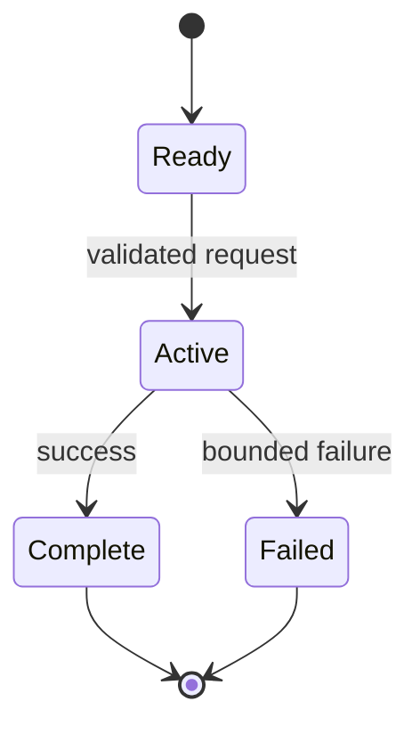

# Module NN: Title

> **Content status:** `planned | draft | reviewed | current`
>
> **Reviewed revision:** `<git revision or not-yet-reviewed>`
>
> **Estimated time:** `<reading + exercise>`
>
> **Canonical concepts:** `<links to concept pages; link rather than duplicate explanations>`

Use this template for every ordered course module. Remove authoring prompts before review, but keep every top-level section. If a diagram type does not apply, retain its heading and explain why.

## Why this module exists

State the learner problem in beginner-friendly language, why it matters in Archon, and the artifact the learner will produce. Do not repeat mutable project status; link to canonical evidence.

## Prerequisites and vocabulary

### Learn first

- [Module or concept](<relative-link>) — why it is required.

### Vocabulary

| Term | Beginner definition | Canonical source |
|---|---|---|
| `<term>` | `<plain-English definition without circular jargon>` | [Concept](<relative-link>) |

## Learning outcomes

After this module, the learner can:

1. `<observable outcome>`;
2. `<trace or explain outcome>`;
3. `<exercise or evidence outcome>`;
4. `<limitation/interview outcome>`.

## Problem and mental model

Describe:

- the problem before introducing implementation detail;
- one memorable mental model and where that analogy stops working;
- inputs, outputs, state, boundaries, and invariants;
- how this module connects to `Policy → Run → Approval → Tool → Evidence → Evaluation`.

Link detailed reusable definitions to concept pages. Do not create a second canonical explanation here.

## Architecture and components

Explain component responsibilities and trust boundaries. Link the repository's existing architecture page when it already contains the authoritative current view.



### Component responsibilities

| Component | Responsibility | Must not be assumed |
|---|---|---|
| `<name>` | `<one bounded responsibility>` | `<non-goal or boundary>` |

## Startup sequence

Show construction, dependency injection, registration, migration/configuration, and readiness steps relevant to this module. If startup is irrelevant, say why and identify when the concept becomes active.



## Per-request sequence

Show one normal request and at least one important alternate/failure path. Distinguish sync, streaming, background, and post-run behavior when relevant.



## Class and dependency view

Show Protocols/interfaces, concrete implementations, ownership, and dependency direction when applicable. Do not imply inheritance where the code uses composition.



## State and lifecycle

Name initial, active, waiting, terminal, and failure states as applicable. State diagrams must match typed stop reasons and persisted events rather than invent generic states.



## Source walkthrough

Pin claims to symbols, not just files. Use repository-relative links that resolve at review time.

| Order | Source symbol | Why inspect it | Implementation status/boundary |
|---:|---|---|---|
| 1 | [`module.path:Symbol`](<source-link>) | `<contract or behavior>` | `implemented | partial | not-implemented | deferred` — `<boundary>` |

### Tests to inspect

| Test | Contract proved | What it does not prove |
|---|---|---|
| [`test_file.py::test_name`](<test-link>) | `<behavior>` | `<live/provider/scale/production limit>` |

## Try it: command or bounded exercise

### Goal

`<single observable learning goal>`

### Safety and setup

- Required services/data: `<none or exact prerequisites>`
- Side effects and cleanup: `<files, containers, database rows, credentials>`
- Do not use real secrets or unreviewed external resources.

### Steps

```bash
# Commands must be executable from a stated working directory.
<command>
```

Or provide a bounded paper/code-reading exercise when execution is inappropriate.

### Done criteria

- [ ] `<observable result, not merely “command exited”>`
- [ ] `<learner can connect result to a source symbol/test/event>`
- [ ] `<cleanup completed>`

## Security and failure modes

| Threat or failure | Boundary/control | Failure behavior | Residual risk |
|---|---|---|---|
| `<case>` | `<validation, policy, isolation, ownership, timeout, etc.>` | `<fail closed/open and evidence>` | `<what remains>` |

Include malformed input, dependency failure, timeout/cancellation, concurrency/idempotency, authorization/ownership, secret/PII handling, and resource exhaustion when applicable.

## Observability and evidence path

Trace where a learner can inspect the behavior without exposing chain-of-thought or secrets.

```text
request/correlation ID → log/event → persisted run/evidence → metric/trace/UI → evaluation
```

| Evidence | Link or command | Claim supported | Scope/limit |
|---|---|---|---|
| Canonical status | [Implementation evidence](<evidence-matrix-link>) | `<current capability dimension>` | `<revision/environment>` |
| Runtime artifact | [`artifact`](<runtime-evidence-link>) | `<observed behavior>` | `<mock/local/provider boundary>` |

Record revision, environment, and exact command for new observations. Do not copy mutable test totals or status tables into the module.

## Lab vs production

| Dimension | Demonstrated in this repository/lab | Required or unverified for production |
|---|---|---|
| Deployment | `<local/test evidence>` | `<public deployment/SLO/multi-host gap>` |
| Data and scale | `<fixture or local volume>` | `<capacity, retention, migration gap>` |
| Providers/dependencies | `<mock/scripted/local/external evidence>` | `<parity or recovery gap>` |
| Security/operations | `<tested control>` | `<trusted boundary/audit/rotation/monitoring gap>` |

State the concept status and why. Never translate local Docker, a manifest, mock, fixture, or unit test into a production claim.

## Interview answer

### 30-second answer

> `<problem → design → evidence → limitation>`

### Deeper follow-ups

- **Why this design?** `<trade-off>`
- **What fails?** `<failure and control>`
- **How do you know?** `<source + test + observed evidence>`
- **What would production require?** `<specific gap>`

Avoid “guarantees,” provider parity, pgvector, generic self-reflection, dynamic swarms, or deployed/production-ready claims unless current direct evidence supports them.

## Self-check

1. `<beginner definition question>`
2. `<request/startup trace question>`
3. `<source symbol and test question>`
4. `<security/failure scenario question>`
5. `<evidence and implementation-status question>`
6. `<lab-vs-production question>`

<details>
<summary>Answer guide</summary>

1. `<concise answer and canonical concept link>`
2. `<concise answer>`
3. `<exact symbol/test>`
4. `<control and residual risk>`
5. `<status, evidence, and boundary>`
6. `<verified scope versus gap>`

</details>

## Further reading

- [Canonical concept](<concept-link>)
- [Code walkthrough](<walkthrough-link>)
- [Architecture diagrams](<architecture-link>)
- [Implementation evidence](<evidence-link>)
- [Next module](<next-module-link>)

## Luis study note (optional)

> Keep this callout brief and personal: a mnemonic, confusing distinction, or interview reminder. It must not become a second canonical explanation or alter the English technical claim.
