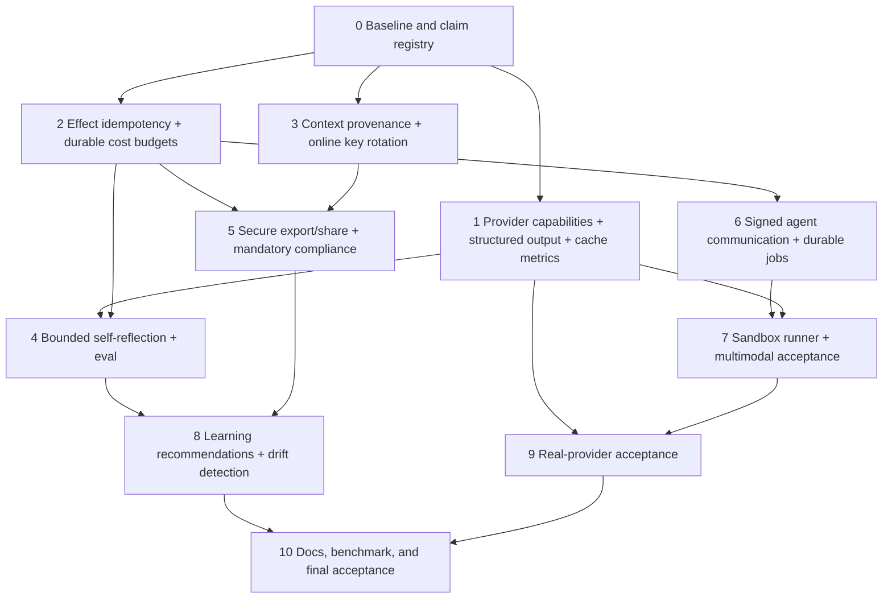

# Archon Capstone Completion Program

> **For Hermes:** Use subagent-driven-development and the software-development-lifecycle skill. Implement one vertical slice at a time with RED → GREEN → review → commit. No push without Luis's explicit approval.

**Goal:** Close the remaining high-value code and evidence gaps while keeping Archon a local-first, evidence-driven Agent Reliability Workbench.

**Architecture:** Extend the existing typed runtime, repositories, FastAPI/Svelte surfaces, PostgreSQL ledger, Redis controls, Docker Compose target, and evaluation system. Do not add another agent framework. New autonomous behavior is bounded, opt-in, owner-scoped, budgeted, observable, and human-approved where it can change state or configuration.

**Tech Stack:** Python 3.11, FastAPI, Pydantic, SQLAlchemy/Alembic, PostgreSQL, Redis, SvelteKit, pytest, Vitest, Playwright, Docker Compose, OpenTelemetry.

**Scope boundary:** Local implementation and evidence only. Public deployment, Kubernetes validation, high-throughput serving, distributed agent networks, and fine-tuning remain documented as deferred unless separately authorized.

---

## Non-negotiable acceptance rules

1. Every slice starts with a failing behavior test.
2. No provider capability may silently degrade; unsupported contracts fail before a model call.
3. No chain-of-thought is persisted or exposed.
4. No secret, raw credential, private key, token, or `.env` value enters source, logs, events, exports, or reports.
5. External side effects receive stable idempotency identity, but Archon must not claim universal exactly-once semantics.
6. Reflection, optimization, exports, jobs, delegation, and sandbox calls are owner/project scoped and budgeted.
7. Optimization produces recommendations/candidates; activation requires explicit human approval.
8. The sandbox runner must not receive the host Docker socket.
9. Live provider acceptance is a separate evidence dimension and requires Luis to configure credentials locally without sharing them.
10. `./scripts/verify.sh`, local Compose smoke, security review, and all new focused gates must pass before local integration.

---

# Program dependency graph



---

## Slice 0 — Baseline, migrations, and claim registry

**Objective:** Create an executable status contract before adding behavior.

**Files:**
- Create: `docs/implementation/CAPABILITY-ACCEPTANCE.yaml`
- Create: `backend/tests/unit/test_capability_acceptance_manifest.py`
- Modify: `docs/IMPLEMENTATION-EVIDENCE.md`
- Modify: `scripts/verify.sh`

**Tasks:**
1. Define dimensions: exists, wired, tested, observed, UI, live-provider, deployed.
2. Give every requested capability one stable ID and owner module.
3. Record current state without changing claims.
4. Add a parser test rejecting unknown status values, duplicate IDs, missing evidence, or `implemented` without tests.
5. Add the manifest test to `verify.sh`.

**Acceptance:** Baseline gates green; no runtime behavior changed; no status rounded up.

---

## Slice 1 — Provider capability negotiation, structured outputs, and cache accounting

**Objective:** Make provider behavior explicit and prevent silent capability loss.

**Files:**
- Create: `backend/app/runtime/capabilities.py`
- Create: `backend/app/runtime/structured_output.py`
- Modify: `backend/app/runtime/ports.py`
- Modify: `backend/app/runtime/models.py`
- Modify: `backend/app/runtime/engine.py`
- Modify: `backend/app/agents/anthropic_adapter.py`
- Modify: `backend/app/agents/foundry_adapter.py`
- Modify: `backend/app/agents/openai_adapter.py`
- Modify: `backend/app/agents/ollama_adapter.py`
- Modify: `backend/app/agents/fallback_chain.py`
- Modify: `backend/app/observability/cost_tracker.py`
- Test: `backend/tests/unit/test_provider_capabilities.py`
- Test: `backend/tests/unit/test_structured_output.py`
- Test: `backend/tests/unit/test_cache_usage_accounting.py`

**Design:**
- `ProviderCapabilities`: tools, images, structured JSON/schema, prompt cache, usage fields, streaming.
- `ResponseContract`: schema ID/version plus Pydantic validator; never rely only on “return JSON” prompting.
- Runtime computes required capabilities before calling the provider.
- Fallback candidates that cannot satisfy the same contract are skipped with typed evidence; they do not degrade to text silently.
- Extend usage with cache read/write tokens only when reported; unknown remains `None`, never fabricated zero.

**Acceptance:**
- Unsupported structured/tool/image contract fails before provider call.
- Supported adapters return validated structured output or typed bounded failure.
- Fallback preserves the requested contract.
- Cache usage/cost evidence is provider-reported and optional.

---

## Slice 2 — Durable effect idempotency and monetary budgets

**Objective:** Bound repeated side effects and spending across retries/restarts.

**Files:**
- Create migration: `backend/alembic/versions/*_effect_ledger_and_budget.py`
- Create: `backend/app/runtime/effect_ledger.py`
- Create: `backend/app/observability/budget_repository.py`
- Modify: `backend/app/runtime/engine.py`
- Modify: `backend/app/tools/registry.py`
- Modify: `backend/app/services/run_ledger.py`
- Modify: `backend/app/observability/cost_tracker.py`
- Modify: `backend/app/routes/runs.py`
- Test: `backend/tests/unit/test_effect_ledger.py`
- Test: `backend/tests/integration/test_effect_idempotency.py`
- Test: `backend/tests/unit/test_durable_cost_budget.py`

**Design:**
- Stable effect identity binds owner, project, run, tool, normalized arguments, resource, and schema hash.
- Atomic states: reserved → committed | failed | indeterminate.
- Duplicate committed/reserved effects never execute again; indeterminate effects require explicit review.
- Providers/tools can receive an idempotency key when supported.
- Budget repository atomically reserves estimated cost, reconciles actual usage, and prevents calls beyond configured run/project limit.

**Boundary:** This is at-most-once orchestration plus idempotency-key handoff—not universal exactly-once delivery to arbitrary external systems.

---

## Slice 3 — Effective context provenance and online memory-key rotation

**Objective:** Make model input inspectable and rotate encrypted memory without downtime or plaintext export.

**Status:** Complete locally. Metadata-only provenance, responsive context/rotation inspection, forward migration 11, bounded resumable rotation, generation fencing, and the mandatory legacy-writer drain barrier are implemented and tested. External KMS and deployment remain deferred.

**Files:**
- Create migration: `backend/alembic/versions/*_context_snapshots_and_key_versions.py`
- Create: `backend/app/runtime/context_provenance.py`
- Modify: `backend/app/runtime/context.py`
- Modify: `backend/app/services/auto_compact.py`
- Modify: `backend/app/memory/keys.py`
- Modify: `backend/app/memory/scoped.py`
- Modify: `backend/app/routes/memory.py`
- Create: `backend/app/services/key_rotation.py`
- Test: `backend/tests/integration/test_context_provenance.py`
- Test: `backend/tests/unit/test_memory_key_rotation.py`
- Frontend: extend memory/context inspector with provenance and rotation status.

**Design:**
- Persist a redacted context snapshot manifest: selected message IDs, summary version, memory IDs, skill IDs, estimated tokens, truncation reason—not hidden reasoning/raw secret content.
- Keyring supports active and previous versions.
- Reads decrypt by ciphertext key version; writes use active version.
- Rotation claims rows transactionally and re-encrypts them in bounded batches; interrupted runs resume safely.
- Key retirement is blocked until no ciphertext references the old version.

---

## Slice 4 — Bounded self-reflection and measured benefit

**Objective:** Add real, optional self-reflection without creating unbounded recursive loops.

**Status:** Complete locally. Final-answer reflection is opt-in, tool-free, limited to one critique and at most one revision, hard-bounded by inherited and reflection-specific budgets, privacy-safe in durable events, adversarially tested, and independently approved. The recorded synthetic fixture is scorer evidence only; live-provider benefit is deferred to Slice 9.

**Files:**
- Create: `backend/app/reflection/models.py`
- Create: `backend/app/reflection/service.py`
- Create: `backend/app/reflection/measurement.py`
- Modify: `backend/app/runtime/events.py`
- Modify: `backend/app/runtime/engine.py` or the final-answer workflow boundary
- Modify: `backend/app/services/run_ledger.py`
- Create fixture: `backend/tests/fixtures/evals/reflection-benefit-v1.json`
- Test: `backend/tests/unit/test_bounded_reflection.py`
- Test: `backend/tests/integration/test_reflection_benefit.py`
- Rename: `backend/tests/unit/test_reflexion.py` → `test_tool_error_feedback.py`

**Design:**
- Opt-in `ReflectionPolicy`: disabled, rubric ID/version, one maximum revision, token/time/cost limits.
- No tools or external side effects during critique/revision.
- Structured `ReflectionVerdict`: keep/revise, issue codes, evidence references, confidence; no chain-of-thought.
- Draft and critique are bounded/redacted; only safe summary hashes/events persist.
- Measure baseline vs reflected answer on versioned fixtures; do not claim benefit without a measured delta.

**Acceptance:** Reflection is distinguishable from ReAct error feedback, verifier delegation, and post-run evaluation.

---

## Slice 5 — Secure run export/share and mandatory compliance boundary

**Objective:** Export/share redacted evidence safely and enforce compliance before persistence and effects.

**Files:**
- Create migration: `backend/alembic/versions/*_run_exports_and_share_grants.py`
- Create: `backend/app/services/run_exports.py`
- Create: `backend/app/security/disclosure.py`
- Modify: `backend/app/security/compliance.py`
- Modify: `backend/app/routes/runs.py`
- Modify: `backend/app/routes/stream.py`
- Modify: sync chat route and document ingestion routes
- Create: `backend/app/routes/shares.py`
- Test: `backend/tests/security/test_run_exports.py`
- Test: `backend/tests/integration/test_share_grants.py`
- Frontend: run export/download/revoke UI.

**Design:**
- Export bundle contains manifest, redacted events, citations/eval summaries, checksums, schema/version, and explicit omissions.
- Secret/PII scan runs again at disclosure time.
- Owner-scoped grants are hashed, expiring, revocable, purpose-bound, and read-only.
- No public anonymous sharing in the local-only target.
- Mandatory compliance service executes before supported persistence and before dangerous tool execution in both sync and streaming paths.

---

## Slice 6 — Signed delegation envelopes and durable background jobs

**Objective:** Integrate agent communication security and replace placeholder tasks with restart-safe work.

**Files:**
- Create migration: `backend/alembic/versions/*_durable_jobs_and_nonces.py`
- Create: `backend/app/delegation/envelope.py`
- Modify: `backend/app/delegation/service.py`
- Replace/extend: `backend/app/services/task_queue.py`
- Modify: `backend/app/routes/tasks.py`
- Create: `backend/app/workers/jobs.py`
- Test: `backend/tests/security/test_delegation_envelope.py`
- Test: `backend/tests/integration/test_durable_jobs.py`
- Frontend: owner-scoped job list/cancel/retry status.

**Design:**
- Immutable envelope binds parent/child/run/owner/project/context hash/budget/schema/timestamp/nonce.
- HMAC key version, freshness, nonce uniqueness, constant-time verification, and durable receipt.
- In-process calls still validate the envelope to keep the boundary executable.
- PostgreSQL queue with atomic claim, lease, heartbeat, bounded retry, dead-letter state, cancellation, and idempotency linkage.
- Worker handles only allowlisted job kinds; no arbitrary serialized callables.

---

## Slice 7 — Isolated sandbox runner and multimodal E2E

**Objective:** Enable dangerous code execution in the verified local target without host subprocess fallback and prove supported multimodal paths.

**Files:**
- Create service: `sandbox_runner/`
- Create Unix-socket contract: `backend/app/tools/sandbox_client.py`
- Modify: `backend/app/tools/sandbox.py`
- Modify: `docker-compose.local.yml`
- Modify: Dockerfiles/entrypoints as needed
- Modify multimodal validation in runtime/provider adapters
- Test: `backend/tests/security/test_sandbox_runner.py`
- Test: `backend/tests/integration/test_multimodal_contract.py`
- Add: `scripts/sandbox-runner-smoke.sh`

**Security design:**
- Separate non-root, read-only container with dropped capabilities, seccomp/no-new-privileges, memory/CPU/PID/time/output limits.
- Backend communicates over a private Unix socket volume.
- No host Docker socket.
- No writable shared project filesystem.
- Network disabled for execution jobs; only the control socket is shared.
- Kill entire process group on timeout.
- Image input validates MIME by bytes, size, dimensions, count, ownership, and sanitized metadata.

**Live boundary:** Real multimodal provider evidence is optional and recorded separately from deterministic contract tests.

---

## Slice 8 — Learning recommendations and drift detection

**Objective:** Detect evaluation/data/behavior changes and generate human-reviewed optimization candidates without autonomous production mutation.

**Files:**
- Create migration: `backend/alembic/versions/*_drift_and_candidates.py`
- Create: `backend/app/eval/drift.py`
- Create: `backend/app/eval/candidates.py`
- Modify: `backend/app/eval/service.py`
- Modify: `backend/app/routes/evaluations.py`
- Frontend: evaluation trend/drift/candidate review.
- Test: `backend/tests/unit/test_drift_detection.py`
- Test: `backend/tests/integration/test_optimization_candidates.py`

**Design:**
- Compare versioned dataset cohorts and model/provider/config revisions.
- Detect bounded changes in pass rate, score distributions, latency, token/cost, abstention, citation coverage, unsupported claims, and safety failures.
- Minimum sample and deterministic warning rules; no statistical significance claims without sufficient data.
- Candidate proposes prompt/policy/retrieval/config change plus evidence and rollback plan.
- Promotion requires explicit approval and creates immutable before/after evaluation linkage.
- No model training/fine-tuning in this scope.

---

## Slice 9 — Real provider acceptance

**Objective:** Produce sanitized evidence for the external provider paths that are already coded.

**Files:**
- Harden: `backend/scripts/embedding_smoke.py`
- Create: `backend/scripts/provider_acceptance.py`
- Create: `backend/scripts/multimodal_smoke.py`
- Create generated reports under ignored temporary paths, then commit only sanitized summaries under `docs/evidence/` after review.
- Modify: `docs/IMPLEMENTATION-EVIDENCE.md`

**Required user action:** Luis configures credentials/deployments locally in environment variables. Hermes never reads, prints, stores, or transmits those values.

**Acceptance scenarios:**
1. real embedding provider: provider/model/dimensions, one ingest/query, expected vector validation;
2. real model: native structured output and tool calling;
3. prompt-cache metrics when provider reports them;
4. multimodal input for a provider that advertises images;
5. bounded failure with sanitized error and no credential leakage.

**Blocked condition:** If no valid embedding deployment/key exists, status remains `Partial`; no mock substitutes for this evidence.

---

## Slice 10 — Integrated benchmark, docs, and final acceptance

**Objective:** Make the new capabilities demonstrable and keep intentionally omitted code gaps explicit.

**Files:**
- Extend: `backend/scripts/portfolio_benchmark.py`
- Extend: `scripts/verify.sh`
- Extend: `docs/IMPLEMENTATION-EVIDENCE.md`
- Extend: `docs/course/concept-catalog.yaml` through its generator
- Create: `docs/REMAINING-DEFERRED-GAPS.md`
- Update relevant course concepts/modules/code bookmarks/interview track.

**Benchmark scenarios:**
- reflection disabled vs enabled;
- duplicate side-effect replay;
- budget reservation and provider failure;
- context provenance and key rotation interruption;
- share grant revoke/expiry/redaction;
- signed child envelope replay;
- durable job restart/lease loss;
- sandbox breakout probes;
- drift candidate requiring approval.

**Final gates:**
```bash
./scripts/verify.sh
./scripts/local-deploy-smoke.sh
./scripts/local-dr-smoke.sh /tmp/archon-final-dr.json
cd backend && uv run python scripts/portfolio_benchmark.py --output /tmp/archon-final-benchmark.json --iterations 10
```

**Documentation must explicitly leave these as deferred/not necessary for this capstone:**
- distributed multi-node agent network;
- high-throughput/GPU model serving;
- fine-tuning/training pipeline;
- public/cloud/Kubernetes deployment;
- public anonymous run sharing;
- autonomous unapproved production optimization.

For each gap document: why it is out of scope, what architecture would be required, what evidence would change the status, and why omitting it strengthens rather than weakens the current capstone story.

---

## Delivery order and commit discipline

1. Plan/baseline.
2. One slice branch/worktree at a time unless files are provably disjoint.
3. RED test captured before implementation.
4. Focused tests and security review.
5. Commit the slice locally.
6. Integrate in dependency order.
7. Full acceptance after every cross-cutting integration.
8. No push until Luis approves the completed batch.

## Expected completion semantics

- `implemented`: code exists, is wired, tested, and observable locally.
- `live-evidenced`: an external provider was actually called and sanitized evidence stored.
- `deployment-evidenced`: not part of this program.
- “All requested local code complete” must never be restated as “production 100%.”
