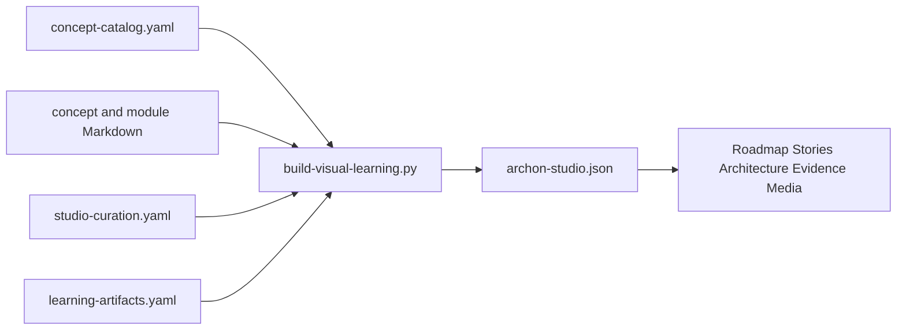

# Visual Learning Studio

The Visual Learning Studio is a multi-view learning interface derived from Archon's canonical course, architecture, and evidence sources. It does not replace those sources.

## Open it

With the managed application running, authenticate and visit:

```text
/learn
```

The legacy `/learn/map` route redirects to the structured Stories view.

## Views

| View | Question it answers | Interaction model |
|---|---|---|
| Roadmap | What should I learn next? | Six fixed phases with expandable modules |
| Stories | What happens during a workflow? | One labeled directional relationship per step |
| Architecture | How is the system structured? | Five stable layers with typed relations |
| Evidence | What is actually implemented and proven? | Searchable status/proof matrix |
| Present | How do I explain Archon visually? | Published HTML decks, diagrams, infographics, and videos |
| Listen | How can I review through audio? | Published English audio lessons and transcripts |
| Study | How can I test comprehension? | Interactive mind maps, flashcards, quizzes, and study guides |

The rejected force-directed overview is intentionally removed. The Studio never displays all 66 concepts as an unlabeled physics graph.

## One-source pipeline



Canonical inputs:

- `docs/course/concept-catalog.yaml`
- `docs/course/concepts/*.md`
- `docs/course/modules/*/README.md`
- `docs/visual-learning/studio-curation.yaml`
- `docs/visual-learning/learning-artifacts.yaml`
- `docs/visual-learning/hermes-generation-promptbook.md`

Generated browser data:

- `frontend/static/learning/archon-studio.json`

## Regenerate and verify

```bash
backend/.venv/bin/python scripts/build-visual-learning.py
backend/.venv/bin/python scripts/build-visual-learning.py --check
backend/.venv/bin/pytest -q \
  backend/tests/unit/test_visual_learning_graph.py \
  backend/tests/unit/test_learning_source_packs.py \
  backend/tests/unit/test_learning_pilot.py \
  backend/tests/unit/test_learning_packs.py \
  backend/tests/unit/test_learning_media.py \
  backend/tests/unit/test_learning_media_routes.py
cd frontend
npm run check
npx vitest run
npx playwright test tests/visual-learning.spec.ts
```

## Hermes-native learning media

Hermes is an offline, supervised publishing lane, not a runtime dependency and not a canonical evidence store. The first review-ready pilot is the English `request-lifecycle` pack. It includes a standalone HTML deck, three diagrams, a structured mind map, 20 flashcards, 10 scenario questions, a study guide, real Edge TTS audio, and a HyperFrames explainer video. The media files remain outside Git, and Luis's content review is still required before the catalog status can become `published`.

```bash
backend/.venv/bin/python scripts/build-learning-pilot.py \
  --output ../archon-learning-media \
  --audio ../archon-learning-media/candidates/request-lifecycle/request-lifecycle-english.mp3 \
  --video ../archon-learning-media/candidates/request-lifecycle/request-lifecycle-video-final.mp4
```

Default output:

```text
../archon-learning-media/
```

The publisher:

- uses only allowlisted public repository files;
- rejects missing, escaping, unsupported, or secret-like paths;
- preserves canonical source paths and SHA-256 checksums;
- records the exact source commit and English-only language contract;
- renders deterministic HTML/SVG/JSON artifacts;
- publishes only through the validated external catalog;
- never makes Hermes a dependency of normal page requests.

Learning-pack definitions:

- System Overview
- Request Lifecycle and Governed Tools
- Memory, RAG, and Evaluation
- Reliability, Security, and Operations
- Interview and Demo Preparation
- Hybrid Agent Orchestration Pilot

All six recipes retain the same planned artifact families, but only artifacts present in the validated published catalog appear as available. The deterministic builders generate structured teaching artifacts and media scripts; audio/video count as published only after their real files pass the runbook checks.

Use [`hermes-generation-promptbook.md`](hermes-generation-promptbook.md) for generation contracts. Follow [`hermes-generation-runbook.md`](hermes-generation-runbook.md) for generation, media validation, publication, and local-runtime verification. NotebookLM files are deprecated migration references only; they are not the active generation lane.

## Honesty boundaries

- A visual component or green evidence cell does not upgrade capability status.
- Story arrows describe only the labeled runtime transition; they are not course prerequisites.
- Deferred concepts may intentionally lack source or test mappings.
- Generated outputs must be reviewed against canonical evidence before reuse.
- Provider credentials, profile memory, private course material, and generated large binaries must not enter Git.
- Exploration in the browser is not course-completion evidence.
