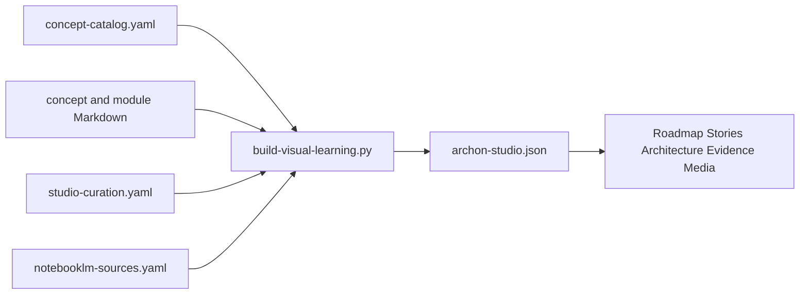

# Visual Learning Studio

The Visual Learning Studio is a multi-view learning interface derived from Archon's canonical course, architecture, and evidence sources. It does not replace those sources.

## Open it

With the managed application running, authenticate and visit:

```text
/learn
```

The legacy `/learn/map` route redirects to the structured Stories view.

## Views

| View | Question it answers | Interaction model |
|---|---|---|
| Roadmap | What should I learn next? | Six fixed phases with expandable modules |
| Stories | What happens during a workflow? | One labeled directional relationship per step |
| Architecture | How is the system structured? | Five stable layers with typed relations |
| Evidence | What is actually implemented and proven? | Searchable status/proof matrix |
| Present | How do I explain Archon visually? | NotebookLM slide/video/infographic recipes |
| Listen | How can I review through audio? | NotebookLM Audio Overview recipes |
| Study | How can I test comprehension? | NotebookLM mind-map/flashcard/quiz recipes |

The rejected force-directed overview is intentionally removed. The Studio never displays all 66 concepts as an unlabeled physics graph.

## One-source pipeline



Canonical inputs:

- `docs/course/concept-catalog.yaml`
- `docs/course/concepts/*.md`
- `docs/course/modules/*/README.md`
- `docs/visual-learning/studio-curation.yaml`
- `docs/visual-learning/notebooklm-sources.yaml`
- `docs/visual-learning/notebooklm-promptbook.md`

Generated browser data:

- `frontend/static/learning/archon-studio.json`

## Regenerate and verify

```bash
backend/.venv/bin/python scripts/build-visual-learning.py
backend/.venv/bin/python scripts/build-visual-learning.py --check
backend/.venv/bin/pytest -q \
  backend/tests/unit/test_visual_learning_graph.py \
  backend/tests/unit/test_notebooklm_source_packs.py
cd frontend
npm run check
npx vitest run
npx playwright test tests/visual-learning.spec.ts
```

## NotebookLM source packs

NotebookLM is an artifact-generation lane inside the Studio, not a canonical evidence store. Build sanitized packs outside the repository:

```bash
backend/.venv/bin/python scripts/build-notebooklm-source-packs.py
```

Default output:

```text
../archon-notebooklm/source-packs/
```

The builder:

- uses only allowlisted public repository files;
- rejects missing, escaping, unsupported, or secret-like paths;
- writes a truth-boundary source into every notebook pack;
- preserves canonical source paths and SHA-256 checksums in `manifest.json`;
- records the exact source commit;
- never uploads anything to Google.

Notebook definitions:

- System Overview
- Request Lifecycle and Governed Tools
- Memory, RAG, and Evaluation
- Reliability, Security, and Operations
- Interview and Demo Preparation

Use [`notebooklm-promptbook.md`](notebooklm-promptbook.md) for Audio Overview, Video Overview, slide deck, infographic, mind map, flashcard, and quiz prompts. Follow [`notebooklm-runbook.md`](notebooklm-runbook.md) for upload order, validation, download storage, and artifact review.

## Honesty boundaries

- A visual component or green evidence cell does not upgrade capability status.
- Story arrows describe only the labeled runtime transition; they are not course prerequisites.
- Deferred concepts may intentionally lack source or test mappings.
- Generated NotebookLM outputs must be reviewed against canonical evidence before reuse.
- NotebookLM authentication state, Google cookies, tokens, and generated large binaries must not enter Git.
- Exploration in the browser is not course-completion evidence.
